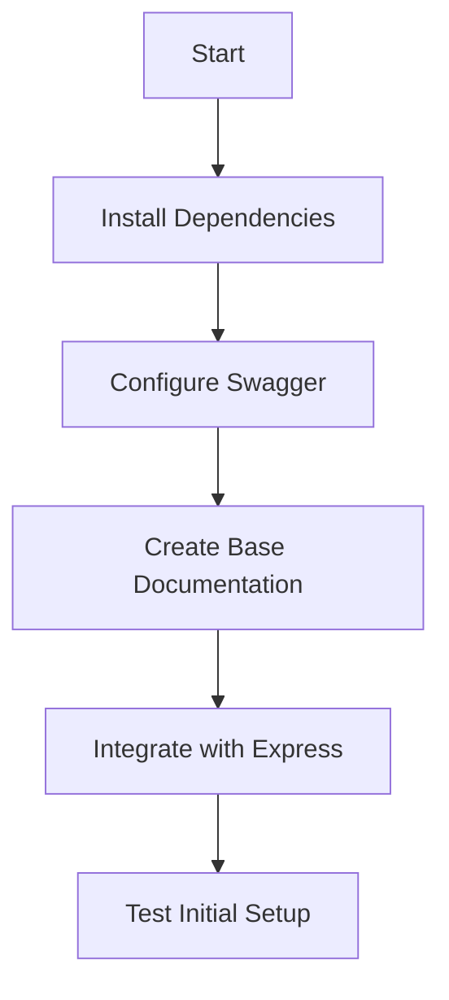
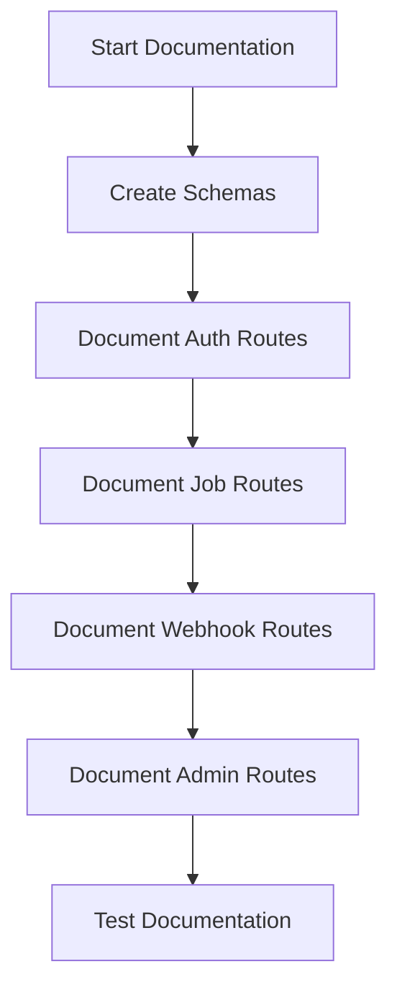
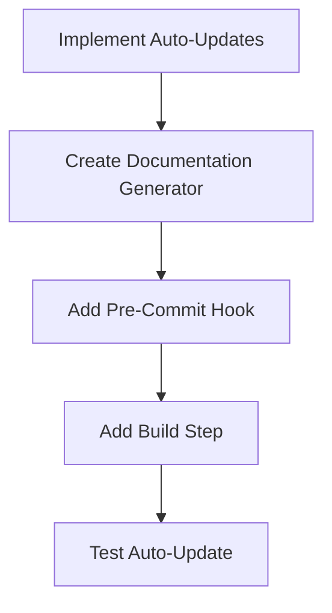
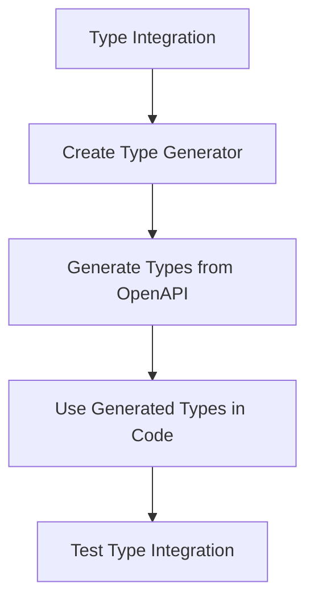
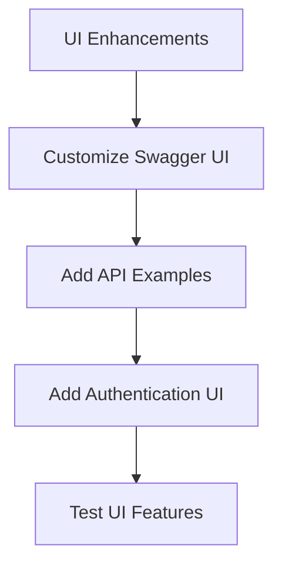

# API Documentation Plan Using Swagger/OpenAPI

## Overview

This plan outlines the implementation of comprehensive API documentation for the JobRunner backend using Swagger/OpenAPI. The documentation will be automatically updated when API changes are made, ensuring it remains accurate and up-to-date.

## Goals

- Document all existing API endpoints with detailed information
- Implement automatic documentation updates when API changes occur
- Provide an interactive UI for exploring and testing the API
- Ensure documentation is accessible to developers and stakeholders

## Implementation Plan

### 1. Setup and Installation



#### Dependencies to Install

- `swagger-jsdoc`: For generating Swagger documentation from JSDoc comments
- `swagger-ui-express`: For serving the Swagger UI
- `express-openapi-validator` (optional): For validating requests against the OpenAPI spec

```bash
pnpm add swagger-jsdoc swagger-ui-express
pnpm add -D @types/swagger-jsdoc @types/swagger-ui-express
```

### 2. Base Configuration Setup

Create a new file `src/config/swagger.ts` to centralize Swagger configuration:

```typescript
import swaggerJSDoc from 'swagger-jsdoc';
import { version } from '../../package.json';

const swaggerDefinition = {
  openapi: '3.0.0',
  info: {
    title: 'JobRunner API Documentation',
    version,
    description: 'API documentation for the JobRunner backend service',
    license: {
      name: 'MIT',
      url: 'https://opensource.org/licenses/MIT',
    },
    contact: {
      name: 'Muve Solutions LLP',
      url: 'https://example.com',
      email: 'info@example.com',
    },
  },
  servers: [
    {
      url: 'http://localhost:4000',
      description: 'Development server',
    },
    {
      url: 'https://api.example.com',
      description: 'Production server',
    },
  ],
  components: {
    securitySchemes: {
      bearerAuth: {
        type: 'http',
        scheme: 'bearer',
        bearerFormat: 'JWT',
      },
    },
  },
  security: [
    {
      bearerAuth: [],
    },
  ],
};

const options = {
  swaggerDefinition,
  apis: ['./src/routes/*.ts', './src/models/*.ts'], // Path to the API docs
};

const swaggerSpec = swaggerJSDoc(options);

export default swaggerSpec;
```

### 3. Integrate Swagger with Express

Update `src/config/app.ts` to include Swagger UI:

```typescript
import express from 'express';
import swaggerUi from 'swagger-ui-express';
import swaggerSpec from './swagger';

// ... existing imports

const app = express();

// ... existing middleware

// Swagger documentation
app.use('/api-docs', swaggerUi.serve, swaggerUi.setup(swaggerSpec));
app.get('/api-docs.json', (req, res) => {
  res.setHeader('Content-Type', 'application/json');
  res.send(swaggerSpec);
});

// ... existing routes

export default app;
```

### 4. Document API Endpoints



#### 4.1 Create Reusable Schemas

Create a file `src/models/schemas.ts` for reusable schemas:

```typescript
/**
 * @openapi
 * components:
 *   schemas:
 *     User:
 *       type: object
 *       required:
 *         - username
 *         - email
 *         - password
 *       properties:
 *         id:
 *           type: string
 *           description: Auto-generated unique identifier
 *         username:
 *           type: string
 *           description: User's username
 *         email:
 *           type: string
 *           format: email
 *           description: User's email
 *         password:
 *           type: string
 *           format: password
 *           description: User's password (hashed)
 *         createdAt:
 *           type: string
 *           format: date-time
 *           description: Creation timestamp
 *         updatedAt:
 *           type: string
 *           format: date-time
 *           description: Last update timestamp
 *     
 *     Job:
 *       type: object
 *       required:
 *         - name
 *       properties:
 *         id:
 *           type: string
 *           description: Auto-generated unique identifier
 *         name:
 *           type: string
 *           description: Job name
 *         data:
 *           type: object
 *           description: Job data payload
 *         status:
 *           type: string
 *           enum: [waiting, active, completed, failed, delayed]
 *           description: Current job status
 *         progress:
 *           type: number
 *           description: Job progress percentage (0-100)
 *         result:
 *           type: object
 *           description: Job execution result
 *         createdAt:
 *           type: string
 *           format: date-time
 *           description: Creation timestamp
 *     
 *     Webhook:
 *       type: object
 *       required:
 *         - url
 *       properties:
 *         id:
 *           type: string
 *           description: Auto-generated unique identifier
 *         url:
 *           type: string
 *           format: uri
 *           description: Webhook URL
 *         events:
 *           type: array
 *           items:
 *             type: string
 *           description: Events to trigger this webhook
 *         active:
 *           type: boolean
 *           description: Whether the webhook is active
 *         createdAt:
 *           type: string
 *           format: date-time
 *           description: Creation timestamp
 *     
 *     Error:
 *       type: object
 *       properties:
 *         message:
 *           type: string
 *           description: Error message
 *         code:
 *           type: string
 *           description: Error code
 */
```

#### 4.2 Document Routes

Example for `src/routes/auth.ts`:

```typescript
/**
 * @openapi
 * /auth/register:
 *   post:
 *     summary: Register a new user
 *     tags: [Authentication]
 *     requestBody:
 *       required: true
 *       content:
 *         application/json:
 *           schema:
 *             type: object
 *             required:
 *               - username
 *               - email
 *               - password
 *             properties:
 *               username:
 *                 type: string
 *               email:
 *                 type: string
 *                 format: email
 *               password:
 *                 type: string
 *                 format: password
 *     responses:
 *       201:
 *         description: User registered successfully
 *         content:
 *           application/json:
 *             schema:
 *               type: object
 *               properties:
 *                 id:
 *                   type: string
 *                 username:
 *                   type: string
 *                 email:
 *                   type: string
 *       400:
 *         description: Invalid input
 *         content:
 *           application/json:
 *             schema:
 *               $ref: '#/components/schemas/Error'
 *       409:
 *         description: User already exists
 *         content:
 *           application/json:
 *             schema:
 *               $ref: '#/components/schemas/Error'
 */
router.post('/register', registerUser);
```

Repeat this pattern for all routes in:
- `src/routes/auth.ts`
- `src/routes/jobs.ts`
- `src/routes/webhooks.ts`
- `src/routes/admin.ts`

### 5. Automated Documentation Updates



#### 5.1 Create Documentation Generator Script

Create a file `scripts/generate-docs.js`:

```javascript
import swaggerJSDoc from 'swagger-jsdoc';
import fs from 'fs';
import path from 'path';
import { fileURLToPath } from 'url';
import { dirname } from 'path';

const __filename = fileURLToPath(import.meta.url);
const __dirname = dirname(__filename);

// Import the swagger config
import swaggerConfig from '../src/config/swagger.js';

// Generate the swagger specification
const swaggerSpec = swaggerJSDoc(swaggerConfig.options);

// Write the swagger specification to a JSON file
const outputPath = path.resolve(__dirname, '../src/swagger.json');
fs.writeFileSync(outputPath, JSON.stringify(swaggerSpec, null, 2));

console.log(`Swagger JSON file written to: ${outputPath}`);
```

#### 5.2 Add NPM Script

Update `package.json`:

```json
{
  "scripts": {
    "generate-docs": "node scripts/generate-docs.js",
    "prebuild": "pnpm run generate-docs",
    "build": "tsc"
  }
}
```

#### 5.3 Add Pre-Commit Hook (Optional)

Install husky for pre-commit hooks:

```bash
pnpm add -D husky lint-staged
npx husky install
npx husky add .husky/pre-commit "npx lint-staged"
```

Update `package.json`:

```json
{
  "lint-staged": {
    "src/routes/*.ts": ["pnpm run generate-docs"]
  }
}
```

### 6. Integration with TypeScript Types

For better type safety and to ensure documentation stays in sync with code:



#### 6.1 Install OpenAPI TypeScript Generator

```bash
pnpm add -D openapi-typescript
```

#### 6.2 Add Type Generation Script

Update `package.json`:

```json
{
  "scripts": {
    "generate-types": "openapi-typescript src/swagger.json --output src/types/api.ts",
    "postgenerate-docs": "pnpm run generate-types"
  }
}
```

#### 6.3 Use Generated Types in Controllers

Example usage:

```typescript
import { components } from '../types/api';

type User = components['schemas']['User'];
type Job = components['schemas']['Job'];

// Now use these types in your controllers
```

### 7. Documentation UI Enhancements



#### 7.1 Customize Swagger UI

Update the Swagger UI configuration in `src/config/app.ts`:

```typescript
app.use(
  '/api-docs',
  swaggerUi.serve,
  swaggerUi.setup(swaggerSpec, {
    explorer: true,
    customCss: '.swagger-ui .topbar { display: none }',
    swaggerOptions: {
      persistAuthorization: true,
      docExpansion: 'none',
      filter: true,
      tagsSorter: 'alpha',
    },
  })
);
```

#### 7.2 Add Documentation Link to README

Update `README.md` to include information about the API documentation:

```markdown
## API Documentation

Interactive API documentation is available at:
```
http://localhost:4000/api-docs
```

The documentation is automatically generated from the codebase and includes:
- Detailed endpoint descriptions
- Request/response schemas
- Authentication requirements
- Example requests and responses

You can also download the OpenAPI specification at:
```
http://localhost:4000/api-docs.json
```
```

### 8. Implementation Timeline

1. **Week 1: Setup and Basic Documentation**
   - Install dependencies
   - Configure Swagger
   - Document core routes (auth, jobs)

2. **Week 2: Complete Documentation and Automation**
   - Document remaining routes
   - Implement auto-update mechanism
   - Add type generation

3. **Week 3: Testing and Refinement**
   - Test documentation accuracy
   - Refine documentation UI
   - Add examples and improve descriptions

## Benefits

- **Improved Developer Experience**: Clear, interactive documentation for all API endpoints
- **Reduced Onboarding Time**: New developers can quickly understand the API
- **Better Testing**: Swagger UI allows testing endpoints directly from the documentation
- **Always Up-to-Date**: Automated updates ensure documentation matches the actual API
- **Type Safety**: Generated TypeScript types ensure consistency between docs and code