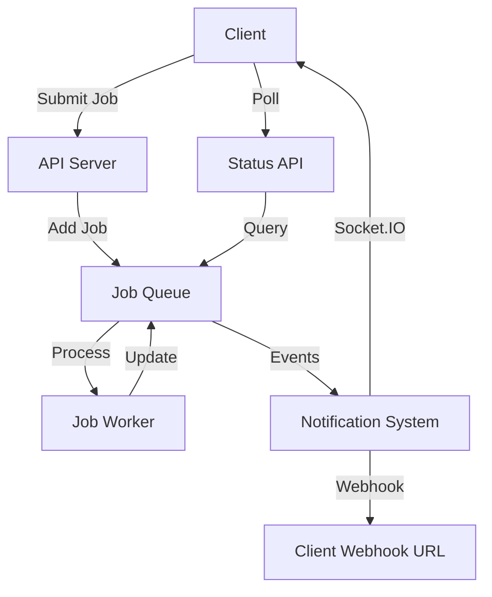

# Job Progress and Completion Notification System - Enhancement Plan

Based on your requirements, I've designed a comprehensive hybrid notification system that combines Socket.IO for real-time updates, REST endpoints for polling, and direct webhooks to client URLs. This approach provides flexibility for different client needs and network conditions.

## 1. System Architecture Overview



## 2. Implementation Details

### 2.1 Socket.IO Real-time Updates

```typescript
// Socket.IO setup with authentication
io.use(async (socket, next) => {
  const token = socket.handshake.auth.token;
  if (!token) {
    return next(new Error("Authentication error"));
  }
  
  try {
    const decoded = jwt.verify(token, process.env.TOKEN_SECRET as string) as UserPayload;
    const user = await userService.getUserById(decoded.userId);
    if (!user) {
      return next(new Error("User not found"));
    }
    
    socket.data.user = {
      userId: decoded.userId,
      username: decoded.username
    };
    next();
  } catch (err) {
    next(new Error("Authentication error"));
  }
});

// Socket.IO connection handling
io.on('connection', (socket) => {
  const userId = socket.data.user.userId;
  logger.info(`User ${userId} connected via Socket.IO`);
  
  // Join user-specific room
  socket.join(`user:${userId}`);
  
  // Allow subscribing to specific job updates
  socket.on('subscribe:job', (jobId) => {
    logger.info(`User ${userId} subscribed to job ${jobId}`);
    socket.join(`job:${jobId}`);
  });
  
  socket.on('unsubscribe:job', (jobId) => {
    logger.info(`User ${userId} unsubscribed from job ${jobId}`);
    socket.leave(`job:${jobId}`);
  });
  
  socket.on('disconnect', () => {
    logger.info(`User ${userId} disconnected`);
  });
});

// Connect queue events to Socket.IO
queueEvents.on('progress', ({ jobId, data }) => {
  const progress = data;
  logger.info(`Job ${jobId} progress: ${progress}%`);
  
  // Emit to job-specific room
  io.to(`job:${jobId}`).emit(`job:${jobId}:progress`, { jobId, progress });
  
  // Also emit to job worker for webhook processing
  jobQueue.getJob(jobId).then(job => {
    if (job) {
      const userId = job.data.userId;
      // Emit to user-specific room
      io.to(`user:${userId}`).emit('job:progress', { jobId, jobName: job.name, progress });
      
      // Add progress update to webhook queue
      webHookQueue.add('progress', {
        id: jobId,
        jobname: job.name,
        userId: userId,
        progress: progress
      });
    }
  });
});

queueEvents.on('completed', ({ jobId, returnvalue }) => {
  logger.info(`Job ${jobId} completed with result: ${returnvalue}`);
  
  // Emit to job-specific room
  io.to(`job:${jobId}`).emit(`job:${jobId}:completed`, { jobId, result: returnvalue });
  
  // Also emit to job worker for webhook processing
  jobQueue.getJob(jobId).then(job => {
    if (job) {
      const userId = job.data.userId;
      // Emit to user-specific room
      io.to(`user:${userId}`).emit('job:completed', { 
        jobId, 
        jobName: job.name, 
        result: returnvalue 
      });
      
      // Add completion update to webhook queue
      webHookQueue.add('completed', {
        id: jobId,
        jobname: job.name,
        userId: userId,
        result: returnvalue
      });
    }
  });
});

queueEvents.on('failed', ({ jobId, failedReason }) => {
  logger.info(`Job ${jobId} failed: ${failedReason}`);
  
  // Emit to job-specific room
  io.to(`job:${jobId}`).emit(`job:${jobId}:failed`, { jobId, error: failedReason });
  
  // Also emit to job worker for webhook processing
  jobQueue.getJob(jobId).then(job => {
    if (job) {
      const userId = job.data.userId;
      // Emit to user-specific room
      io.to(`user:${userId}`).emit('job:failed', { 
        jobId, 
        jobName: job.name, 
        error: failedReason 
      });
      
      // Add failure update to webhook queue
      webHookQueue.add('failed', {
        id: jobId,
        jobname: job.name,
        userId: userId,
        error: failedReason
      });
    }
  });
});
```

### 2.2 REST Endpoints for Job Status Polling

```typescript
// Get status of a specific job
app.get('/jobs/:jobId', authenticateToken, async (req: Request, res: Response) => {
  try {
    const { jobId } = req.params;
    const userId = req.user?.userId;
    
    if (!userId) {
      return res.status(401).json({ message: 'Not authenticated' });
    }
    
    const job = await jobQueue.getJob(jobId);
    
    if (!job) {
      return res.status(404).json({ message: 'Job not found' });
    }
    
    // Ensure user can only access their own jobs
    if (job.data.userId !== userId) {
      return res.status(403).json({ message: 'Unauthorized access to job' });
    }
    
    const state = await job.getState();
    const progress = job.progress || 0;
    const result = job.returnvalue;
    const failedReason = job.failedReason;
    
    res.json({
      id: job.id,
      name: job.name,
      state,
      progress,
      result,
      failedReason,
      timestamp: {
        created: job.timestamp,
        started: job.processedOn,
        finished: job.finishedOn
      }
    });
  } catch (error) {
    logger.error('Job status error:', error);
    res.status(500).json({ message: 'An error occurred while fetching job status' });
  }
});

// Get all jobs for the authenticated user
app.get('/jobs', authenticateToken, async (req: Request, res: Response) => {
  try {
    const userId = req.user?.userId;
    
    if (!userId) {
      return res.status(401).json({ message: 'Not authenticated' });
    }
    
    // Pagination parameters
    const page = parseInt(req.query.page as string) || 1;
    const limit = parseInt(req.query.limit as string) || 10;
    const skip = (page - 1) * limit;
    
    // Filter parameters
    const status = req.query.status as string; // 'completed', 'failed', 'active', 'waiting', 'delayed'
    
    // Get jobs from the queue
    const jobs = await jobQueue.getJobs();
    
    // Filter jobs by user ID and status
    let filteredJobs = jobs.filter(job => job.data.userId === userId);
    
    if (status) {
      const jobsByStatus = await jobQueue.getJobsByStatus(status);
      const jobIds = new Set(jobsByStatus.map(job => job.id));
      filteredJobs = filteredJobs.filter(job => jobIds.has(job.id));
    }
    
    // Apply pagination
    const paginatedJobs = filteredJobs.slice(skip, skip + limit);
    
    // Format response
    const jobsData = await Promise.all(paginatedJobs.map(async (job) => {
      const state = await job.getState();
      return {
        id: job.id,
        name: job.name,
        state,
        progress: job.progress || 0,
        timestamp: {
          created: job.timestamp,
          started: job.processedOn,
          finished: job.finishedOn
        }
      };
    }));
    
    res.json({
      jobs: jobsData,
      pagination: {
        total: filteredJobs.length,
        page,
        limit,
        pages: Math.ceil(filteredJobs.length / limit)
      }
    });
  } catch (error) {
    logger.error('Jobs list error:', error);
    res.status(500).json({ message: 'An error occurred while fetching jobs' });
  }
});
```

### 2.3 Enhanced User Model for Webhook Configuration

First, let's update the Prisma schema to support multiple webhook URLs:

```prisma
model User {
  id                Int       @id @default(autoincrement())
  username          String    @unique
  password          String
  email             String?   @unique
  webhookUrl        String?   // Legacy field
  webhooks          Webhook[]
  createdAt         DateTime  @default(now())
  updatedAt         DateTime  @updatedAt
  
  // For token refresh
  refreshToken      String?   @unique
  refreshTokenExpiry DateTime?
  
  // For password reset
  resetToken        String?   @unique
  resetTokenExpiry  DateTime?
}

model Webhook {
  id          Int      @id @default(autoincrement())
  url         String
  eventType   String   // 'progress', 'completed', 'failed', 'all'
  description String?
  active      Boolean  @default(true)
  createdAt   DateTime @default(now())
  updatedAt   DateTime @updatedAt
  user        User     @relation(fields: [userId], references: [id])
  userId      Int
  
  @@unique([userId, url, eventType])
}
```

Now, let's update the webhook worker to handle different event types and send to the appropriate URLs:

```typescript
// Enhanced webhook worker
const webHooksWorker = new Worker(
  "webhooks",
  async (job) => {
    const { id, jobname, userId, result, progress, error } = job.data;
    const eventType = job.name; // 'progress', 'completed', or 'failed'
    
    logger.info(`WORKER: webhooks ${job.id}/${job.name} active for ${userId}/${id}/${jobname}`);
    
    try {
      // Get user from database
      const user = await userService.getUserById(userId);
      if (!user) {
        logger.error(`User not found: ${userId}`);
        return;
      }
      
      // Get webhooks for this user and event type
      const webhooks = await prisma.webhook.findMany({
        where: {
          userId: userId,
          active: true,
          OR: [
            { eventType: eventType },
            { eventType: 'all' }
          ]
        }
      });
      
      // Legacy support for webhookUrl field
      if (webhooks.length === 0 && user.webhookUrl && eventType === 'completed') {
        webhooks.push({
          id: 0,
          url: user.webhookUrl,
          eventType: 'completed',
          active: true,
          userId: userId,
          createdAt: new Date(),
          updatedAt: new Date(),
          description: 'Legacy webhook'
        });
      }
      
      if (webhooks.length === 0) {
        logger.info(`No webhooks configured for user ${userId} and event ${eventType}`);
        return;
      }
      
      // Prepare payload based on event type
      let payload;
      switch (eventType) {
        case 'progress':
          payload = { id, jobname, userId, progress };
          break;
        case 'completed':
          payload = { id, jobname, userId, result };
          break;
        case 'failed':
          payload = { id, jobname, userId, error };
          break;
        default:
          payload = { id, jobname, userId, eventType };
      }
      
      // Send to all configured webhooks
      const promises = webhooks.map(async (webhook) => {
        try {
          logger.info(`Sending ${eventType} webhook to ${webhook.url} for job ${id}`);
          await got.post(webhook.url, { 
            json: payload,
            timeout: { request: 10000 }, // 10s timeout
            retry: { limit: 3 } // Retry 3 times
          });
          logger.info(`Successfully sent webhook to ${webhook.url}`);
          return true;
        } catch (error) {
          logger.error(`Failed to send webhook to ${webhook.url}: ${error}`);
          return false;
        }
      });
      
      await Promise.all(promises);
    } catch (error) {
      logger.error(`Webhook processing error: ${error}`);
    }
  },
  { connection: redisOptions }
);
```

### 2.4 Webhook Configuration Endpoints

```typescript
// Get all webhooks for the authenticated user
app.get('/webhooks', authenticateToken, async (req: Request, res: Response) => {
  try {
    const userId = req.user?.userId;
    
    if (!userId) {
      return res.status(401).json({ message: 'Not authenticated' });
    }
    
    const webhooks = await prisma.webhook.findMany({
      where: { userId }
    });
    
    res.json({ webhooks });
  } catch (error) {
    logger.error('Webhooks list error:', error);
    res.status(500).json({ message: 'An error occurred while fetching webhooks' });
  }
});

// Add a new webhook
app.post('/webhooks', authenticateToken, async (req: Request, res: Response) => {
  try {
    const userId = req.user?.userId;
    
    if (!userId) {
      return res.status(401).json({ message: 'Not authenticated' });
    }
    
    const { url, eventType, description } = req.body;
    
    if (!url || !eventType) {
      return res.status(400).json({ message: 'URL and event type are required' });
    }
    
    // Validate event type
    const validEventTypes = ['progress', 'completed', 'failed', 'all'];
    if (!validEventTypes.includes(eventType)) {
      return res.status(400).json({ 
        message: `Invalid event type. Must be one of: ${validEventTypes.join(', ')}` 
      });
    }
    
    // Check if webhook already exists
    const existingWebhook = await prisma.webhook.findFirst({
      where: {
        userId,
        url,
        eventType
      }
    });
    
    if (existingWebhook) {
      return res.status(409).json({ message: 'Webhook already exists' });
    }
    
    // Create new webhook
    const webhook = await prisma.webhook.create({
      data: {
        url,
        eventType,
        description,
        userId
      }
    });
    
    res.status(201).json({ webhook });
  } catch (error) {
    logger.error('Webhook creation error:', error);
    res.status(500).json({ message: 'An error occurred while creating webhook' });
  }
});

// Update a webhook
app.put('/webhooks/:id', authenticateToken, async (req: Request, res: Response) => {
  try {
    const userId = req.user?.userId;
    const webhookId = parseInt(req.params.id);
    
    if (!userId) {
      return res.status(401).json({ message: 'Not authenticated' });
    }
    
    // Check if webhook exists and belongs to user
    const webhook = await prisma.webhook.findFirst({
      where: {
        id: webhookId,
        userId
      }
    });
    
    if (!webhook) {
      return res.status(404).json({ message: 'Webhook not found' });
    }
    
    const { url, eventType, description, active } = req.body;
    
    // Validate event type if provided
    if (eventType) {
      const validEventTypes = ['progress', 'completed', 'failed', 'all'];
      if (!validEventTypes.includes(eventType)) {
        return res.status(400).json({ 
          message: `Invalid event type. Must be one of: ${validEventTypes.join(', ')}` 
        });
      }
    }
    
    // Update webhook
    const updatedWebhook = await prisma.webhook.update({
      where: { id: webhookId },
      data: {
        url: url !== undefined ? url : webhook.url,
        eventType: eventType !== undefined ? eventType : webhook.eventType,
        description: description !== undefined ? description : webhook.description,
        active: active !== undefined ? active : webhook.active
      }
    });
    
    res.json({ webhook: updatedWebhook });
  } catch (error) {
    logger.error('Webhook update error:', error);
    res.status(500).json({ message: 'An error occurred while updating webhook' });
  }
});

// Delete a webhook
app.delete('/webhooks/:id', authenticateToken, async (req: Request, res: Response) => {
  try {
    const userId = req.user?.userId;
    const webhookId = parseInt(req.params.id);
    
    if (!userId) {
      return res.status(401).json({ message: 'Not authenticated' });
    }
    
    // Check if webhook exists and belongs to user
    const webhook = await prisma.webhook.findFirst({
      where: {
        id: webhookId,
        userId
      }
    });
    
    if (!webhook) {
      return res.status(404).json({ message: 'Webhook not found' });
    }
    
    // Delete webhook
    await prisma.webhook.delete({
      where: { id: webhookId }
    });
    
    res.json({ message: 'Webhook deleted successfully' });
  } catch (error) {
    logger.error('Webhook deletion error:', error);
    res.status(500).json({ message: 'An error occurred while deleting webhook' });
  }
});
```

## 3. Client Integration Examples

### 3.1 Socket.IO Client Example

```javascript
// Browser client example
const socket = io('http://localhost:4000', {
  auth: {
    token: 'your_jwt_token'
  }
});

// Listen for connection events
socket.on('connect', () => {
  console.log('Connected to server');
  
  // Subscribe to a specific job
  socket.emit('subscribe:job', 'job123');
});

// Listen for job progress
socket.on('job:progress', (data) => {
  console.log(`Job ${data.jobId} progress: ${data.progress}%`);
  updateProgressBar(data.progress);
});

// Listen for job completion
socket.on('job:completed', (data) => {
  console.log(`Job ${data.jobId} completed with result:`, data.result);
  showCompletionMessage(data.result);
});

// Listen for job failure
socket.on('job:failed', (data) => {
  console.log(`Job ${data.jobId} failed:`, data.error);
  showErrorMessage(data.error);
});

// Unsubscribe when done
function unsubscribeFromJob(jobId) {
  socket.emit('unsubscribe:job', jobId);
}
```

### 3.2 REST API Client Example

```javascript
// Fetch job status
async function getJobStatus(jobId) {
  const response = await fetch(`http://localhost:4000/jobs/${jobId}`, {
    headers: {
      'Authorization': `Bearer ${token}`
    }
  });
  
  if (!response.ok) {
    throw new Error(`Failed to fetch job status: ${response.statusText}`);
  }
  
  return response.json();
}

// Poll job status until completion
async function pollJobStatus(jobId, interval = 2000) {
  const checkStatus = async () => {
    try {
      const status = await getJobStatus(jobId);
      
      updateUI(status);
      
      if (status.state === 'completed' || status.state === 'failed') {
        return status;
      }
      
      // Continue polling
      setTimeout(checkStatus, interval);
    } catch (error) {
      console.error('Error polling job status:', error);
    }
  };
  
  return checkStatus();
}
```

### 3.3 Webhook Receiver Example

```javascript
// Node.js Express webhook receiver example
const express = require('express');
const app = express();
app.use(express.json());

app.post('/webhooks/job-progress', (req, res) => {
  const { id, jobname, userId, progress } = req.body;
  console.log(`Job ${id} (${jobname}) progress: ${progress}%`);
  
  // Process the progress update
  updateJobProgress(id, progress);
  
  res.status(200).end();
});

app.post('/webhooks/job-completed', (req, res) => {
  const { id, jobname, userId, result } = req.body;
  console.log(`Job ${id} (${jobname}) completed with result:`, result);
  
  // Process the completion
  markJobAsCompleted(id, result);
  
  res.status(200).end();
});

app.post('/webhooks/job-failed', (req, res) => {
  const { id, jobname, userId, error } = req.body;
  console.log(`Job ${id} (${jobname}) failed:`, error);
  
  // Process the failure
  markJobAsFailed(id, error);
  
  res.status(200).end();
});

app.listen(3000, () => {
  console.log('Webhook receiver listening on port 3000');
});
```

## 4. Migration Steps

1. Update Prisma schema to add the Webhook model
2. Run Prisma migration: `npx prisma migrate dev --name add_webhooks`
3. Implement Socket.IO event handlers
4. Implement REST endpoints for job status
5. Enhance webhook worker to support different event types
6. Add webhook configuration endpoints
7. Test all notification methods

## 5. Security Considerations

1. **Authentication**: All notification channels are authenticated
   - Socket.IO connections require valid JWT
   - REST endpoints use the existing authentication middleware
   - Webhooks are tied to specific users and verified

2. **Authorization**: Users can only access their own jobs and webhooks

3. **Rate Limiting**: Implement rate limiting for webhook deliveries and API requests

4. **Webhook Verification**: Consider adding webhook signatures for verification

5. **Data Privacy**: Ensure sensitive job data is not leaked in notifications

This comprehensive notification system provides multiple ways for clients to stay updated on job progress and completion, catering to different use cases and requirements.