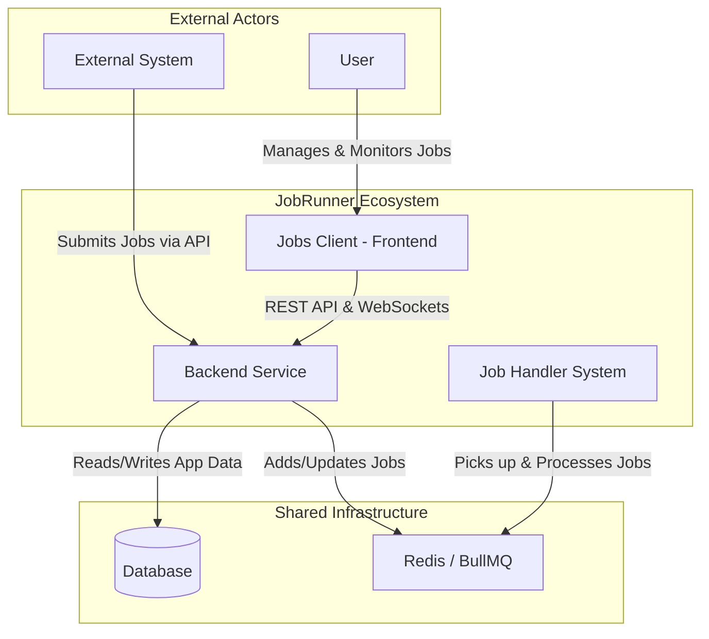
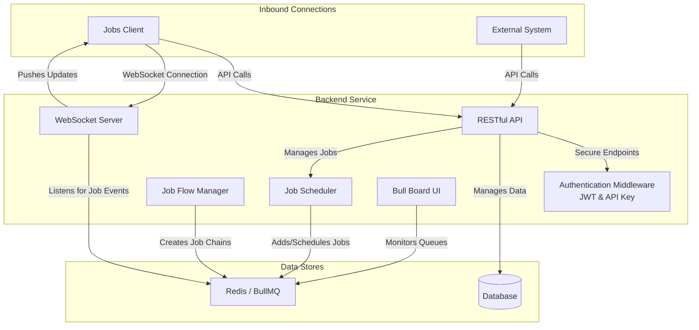
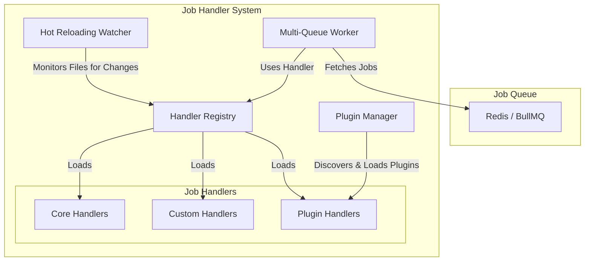

# JobRunner System Architecture

This document provides a series of diagrams illustrating the architecture of the JobRunner system, starting from a high-level overview and then detailing each of the core components.

## 1. High-Level System Overview

This diagram shows the primary components of JobRunner and how they interact with each other and with external systems.



---

## 2. Backend Service Architecture

This diagram details the internal components of the Backend Service.


---

## 3. Job Handler System Architecture

This diagram illustrates the architecture of the standalone Job Handler System.


---

## 4. Jobs Client (Frontend) Architecture

This diagram shows the structure of the Jobs Client.

```mermaid
graph TD
    subgraph "User"
        C_USER[User]
    end

    subgraph "Jobs Client (React Application)"
        direction TB
        C_PAGES[Pages & Routing]
        
        subgraph "Features"
            C_DASH[Dashboard]
            C_JOBS[Job Management]
            C_SCHEDULER[Scheduler]
            C_AUTH[Authentication UI]
        end

        subgraph "Core Client Logic"
            C_API[API Service]
            C_SOCKET[WebSocket Client]
            C_STATE[State Management]
        end
    end

    subgraph "Backend"
        C_BACKEND[Backend Service]
    end

    C_USER -- "Interacts with" --> C_PAGES

    C_PAGES -- "Renders" --> C_DASH & C_JOBS & C_SCHEDULER & C_AUTH
    C_DASH & C_JOBS & C_SCHEDULER -- "Uses" --> C_API & C_SOCKET
    C_AUTH -- "Uses" --> C_API

    C_API -- "HTTP/S Requests" --> C_BACKEND
    C_SOCKET -- "Real-time Connection" --> C_BACKEND
    C_STATE -- "Caches Data for" --> C_PAGES
