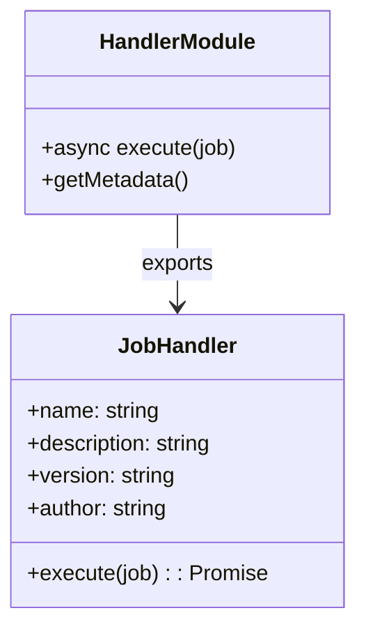
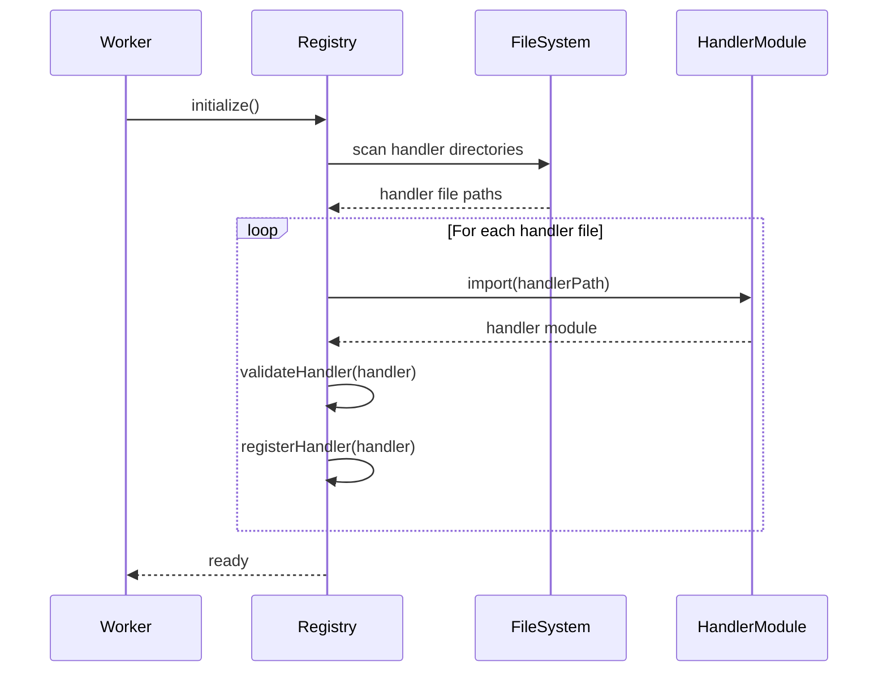

# Implementation Plan: Dynamic Handler Registration System for BullMQ Worker

## Current Architecture

The current implementation has these key components:

1. **Worker (worker.js)**: Processes jobs from a hardcoded "jobQueue" using handlers defined in a `jobHandlers` object
2. **Job Processing**: Uses a simple lookup mechanism to find handlers by job name
3. **Handler Definition**: All handlers are defined within the worker.js file
4. **Webhook Worker**: Separate worker that processes webhook notifications
5. **Queue Name**: The queue name is hardcoded as "jobQueue"

## Proposed Architecture

We'll implement a dynamic handler registration system with the following features:

1. **Modular Handlers**: Move handlers to separate files named after the job type
2. **Dynamic Registration**: Create a mechanism to discover and register handlers
3. **Extensibility**: Allow users to add custom handlers without modifying core files
4. **Configurable Queue Names**: Allow the worker to process jobs from any queue name
5. **Backward Compatibility**: Ensure existing jobs continue to work

## Implementation Steps

### 1. Create a Handlers Directory Structure

```
/handlers
  ├── core/                 # Core system handlers
  │   ├── welcomeMessage.js
  │   ├── dataExport.js
  │   └── ollama.js
  └── custom/               # Directory for user-defined handlers
      └── README.md         # Instructions for adding custom handlers
```

### 2. Create Handler Module Template

Each handler will be a module that exports a function with a standard interface:



### 3. Implement Handler Registry

Create a registry system that:
- Discovers handlers in the filesystem
- Validates handler interfaces
- Registers handlers by name
- Provides lookup functionality



### 4. Modify Worker to Use Registry

Update the worker to use the handler registry instead of the hardcoded `jobHandlers` object.

### 5. Implement Handler Discovery

Create a mechanism to discover handlers in both core and custom directories.

### 6. Create Configuration System

Implement a configuration system that allows:
- Specifying handler directories
- Enabling/disabling specific handlers
- Setting handler-specific options
- **Configuring queue names** for the worker to process

### 7. Multi-Queue Support

Implement support for processing jobs from multiple queues:
- Allow configuring multiple queue names
- Support different handler sets for different queues
- Enable queue-specific configuration options

## Detailed Implementation

### 1. Handler Module Structure

Each handler will be in its own file with the same name as the job type:

```javascript
// handlers/core/welcomeMessage.js
export default {
  name: 'welcomeMessage',
  description: 'Sends a welcome message to the user',
  version: '1.0.0',
  author: 'System',
  
  async execute(job) {
    // Implementation of the handler
    logger.debug(`Job : ${job.id} : ${job.name} for ${job.data.username}`);
    return { status: 'done', jobid: job.id };
  }
};
```

### 2. Handler Registry Implementation

```javascript
// src/registry.js
import fs from 'fs/promises';
import path from 'path';
import { fileURLToPath } from 'url';
import { logger } from '@ugm/logger';

class HandlerRegistry {
  constructor() {
    this.handlers = new Map();
    this.directories = [];
  }

  // Add a directory to scan for handlers
  addDirectory(directory) {
    this.directories.push(directory);
    return this;
  }

  // Register a handler
  registerHandler(handler) {
    if (!this.validateHandler(handler)) {
      logger.warn(`Invalid handler: ${handler.name || 'unknown'}`);
      return false;
    }
    
    this.handlers.set(handler.name, handler);
    logger.info(`Registered handler: ${handler.name}`);
    return true;
  }

  // Get a handler by name
  getHandler(name) {
    return this.handlers.get(name);
  }

  // Validate handler interface
  validateHandler(handler) {
    return (
      handler &&
      typeof handler.name === 'string' &&
      typeof handler.execute === 'function'
    );
  }

  // Discover and load all handlers
  async discoverHandlers() {
    for (const directory of this.directories) {
      await this.loadHandlersFromDirectory(directory);
    }
    
    logger.info(`Loaded ${this.handlers.size} handlers`);
    return this.handlers;
  }

  // Load handlers from a directory
  async loadHandlersFromDirectory(directory) {
    try {
      const files = await fs.readdir(directory);
      
      for (const file of files) {
        if (file.endsWith('.js')) {
          const handlerPath = path.join(directory, file);
          try {
            const handlerModule = await import(handlerPath);
            const handler = handlerModule.default;
            
            if (handler) {
              this.registerHandler(handler);
            }
          } catch (error) {
            logger.error(`Error loading handler from ${handlerPath}: ${error.message}`);
          }
        }
      }
    } catch (error) {
      logger.error(`Error reading directory ${directory}: ${error.message}`);
    }
  }
}

export default new HandlerRegistry();
```

### 3. Updated Worker Implementation

```javascript
// worker.js (updated)
import { Worker, Queue } from "bullmq";
import { logger } from '@ugm/logger';
import path from 'path';
import { fileURLToPath } from 'url';
import registry from './registry.js';

// ... other imports and setup ...

// Initialize handler registry
const __dirname = path.dirname(fileURLToPath(import.meta.url));
const coreHandlersDir = path.join(__dirname, 'handlers', 'core');
const customHandlersDir = path.join(__dirname, 'handlers', 'custom');

// Add directories to registry
registry.addDirectory(coreHandlersDir);
registry.addDirectory(customHandlersDir);

// Process jobs from the queue
const processJob = async (job) => {
  const handler = registry.getHandler(job.name);

  if (handler) {
    logger.info(`Processing job: ${job.id} : ${job.name}`);
    try {
      const retval = await handler.execute(job);
      if (retval) {
        return retval;
      }
    } catch (error) {
      logger.error(`Error executing handler for ${job.name}: ${error.message}`);
      throw error;
    }
  } else {
    logger.error(`${job.id}: ${job.name} : Handler not available`);
    throw new Error(`${job.id}: ${job.name} : Handler not available`);
  }
};

// Initialize registry before creating worker
(async () => {
  try {
    await registry.discoverHandlers();
    
    // Load configuration
    const config = await configManager.load();
    
    // Get queue names from configuration (with fallback to default)
    const queueNames = config.queueNames || ['jobQueue'];
    
    // Create workers for each queue
    const workers = queueNames.map(queueName => {
      logger.info(`Creating worker for queue: ${queueName}`);
      const worker = new Worker(queueName, processJob, { connection: redisOptions });
      
      // Set up event listeners for this worker
      worker.on("completed", (job, returnvalue) => {
        logger.info(`${job.id} : ${job.name} for ${job.data.username} : completed!`);
      });
      
      worker.on("progress", (job, progress) => {
        logger.info(`\t ${job.name} : progress ${progress}%`);
      });
      
      worker.on("failed", (job, err) => {
        logger.error(`${job.id} has failed with ${err.message}`);
      });
      
      return worker;
    });
    
    logger.info(`Worker started with dynamic handler registry for ${queueNames.length} queues!`);
  } catch (error) {
    logger.error(`Failed to initialize worker: ${error.message}`);
    process.exit(1);
  }
})();
```

### 4. Configuration System

```javascript
// config.js
import fs from 'fs/promises';
import path from 'path';
import { fileURLToPath } from 'url';

const __dirname = path.dirname(fileURLToPath(import.meta.url));
const defaultConfigPath = path.join(__dirname, 'config.json');

class Config {
  constructor() {
    this.config = {
      handlerDirectories: [
        path.join(__dirname, 'handlers', 'core'),
        path.join(__dirname, 'handlers', 'custom')
      ],
      queueNames: ['jobQueue'],  // Default queue name
      queueConfigs: {            // Queue-specific configurations
        'jobQueue': {
          concurrency: 10,
          handlers: '*'  // '*' means use all available handlers
        }
      },
      disabledHandlers: [],
      handlerOptions: {}
    };
  }

  async load(configPath = defaultConfigPath) {
    try {
      const configData = await fs.readFile(configPath, 'utf8');
      const userConfig = JSON.parse(configData);
      this.config = { ...this.config, ...userConfig };
    } catch (error) {
      // If config file doesn't exist, use defaults
      if (error.code !== 'ENOENT') {
        throw error;
      }
    }
    return this.config;
  }

  isHandlerEnabled(handlerName, queueName = null) {
    // Check global disabled handlers
    if (this.config.disabledHandlers.includes(handlerName)) {
      return false;
    }
    
    // If queue name is provided, check queue-specific configuration
    if (queueName && this.config.queueConfigs[queueName]) {
      const queueConfig = this.config.queueConfigs[queueName];
      
      // If handlers is an array, check if the handler is included
      if (Array.isArray(queueConfig.handlers)) {
        return queueConfig.handlers.includes(handlerName);
      }
      
      // If handlers is '*', all handlers are enabled for this queue
      return queueConfig.handlers === '*';
    }
    
    return true;
  }

  getHandlerOptions(handlerName) {
    return this.config.handlerOptions[handlerName] || {};
  }

  getHandlerDirectories() {
    return this.config.handlerDirectories;
  }
  
  getQueueNames() {
    return this.config.queueNames || ['jobQueue'];
  }
  
  getQueueConfig(queueName) {
    return this.config.queueConfigs[queueName] || { concurrency: 10, handlers: '*' };
  }
}

export default new Config();
```

### 5. Handler API for Extensions

Create a simple API for handler registration:

```javascript
// handlerAPI.js
import registry from './registry.js';

export const registerHandler = (handler) => {
  return registry.registerHandler(handler);
};

export const createHandler = (name, executeFn, metadata = {}) => {
  return {
    name,
    execute: executeFn,
    description: metadata.description || '',
    version: metadata.version || '1.0.0',
    author: metadata.author || 'Unknown',
    ...metadata
  };
};
```

## Migration Plan

1. Create the directory structure
2. Move existing handlers to individual files
3. Implement the registry system
4. Update the worker to use the registry
5. Test with existing handlers
6. Add documentation for extending with custom handlers

## Documentation for Users

Create a README.md in the custom handlers directory with instructions:

```markdown
# Custom Handlers

This directory is for custom job handlers that extend the worker functionality.

## Adding a Custom Handler

1. Create a new JavaScript file named after your job type (e.g., `myCustomJob.js`)
2. Export a handler object with the following structure:

```javascript
export default {
  name: 'myCustomJob',  // Must match the filename (without .js)
  description: 'Description of what this handler does',
  version: '1.0.0',
  author: 'Your Name',
  
  async execute(job) {
    // Your handler implementation
    // job.data contains the job data
    
    // Return a result object
    return { status: 'done', result: 'some result' };
  }
};
```

3. Restart the worker to load your custom handler
4. Submit jobs with the name matching your handler name
```

## Example Configuration File

```json
{
  "handlerDirectories": [
    "./handlers/core",
    "./handlers/custom",
    "/path/to/external/handlers"
  ],
  "queueNames": ["jobQueue", "highPriorityQueue", "scheduledTasks"],
  "queueConfigs": {
    "jobQueue": {
      "concurrency": 10,
      "handlers": "*"
    },
    "highPriorityQueue": {
      "concurrency": 20,
      "handlers": ["welcomeMessage", "dataExport"]
    },
    "scheduledTasks": {
      "concurrency": 5,
      "handlers": ["dataExport", "cleanup", "backup"]
    }
  },
  "disabledHandlers": ["deprecated-handler"],
  "handlerOptions": {
    "dataExport": {
      "maxConcurrent": 5,
      "timeout": 30000
    }
  }
}
```

## Benefits of This Approach

1. **Modularity**: Each handler is in its own file, making the code more maintainable
2. **Extensibility**: Users can add custom handlers without modifying core files
3. **Discoverability**: The system automatically discovers and loads handlers
4. **Configurability**: Handlers can be enabled/disabled and configured via config
5. **Validation**: The registry validates handlers to ensure they meet the required interface
6. **Queue Flexibility**: Support for multiple queues with different configurations

## Dynamic Handler Loading at Runtime

To enable dynamic loading of handlers without restarting the worker, we can implement a file watcher and hot-reload mechanism:

### File Watcher Implementation

```javascript
// src/watcher.js
import chokidar from 'chokidar';
import path from 'path';
import { logger } from '@ugm/logger';
import registry from './registry.js';

class HandlerWatcher {
  constructor() {
    this.watchers = new Map();
    this.debounceTimers = new Map();
  }

  // Watch a directory for changes
  watchDirectory(directory) {
    if (this.watchers.has(directory)) {
      return;
    }

    logger.info(`Setting up watcher for directory: ${directory}`);
    
    const watcher = chokidar.watch(directory, {
      ignored: /(^|[\/\\])\../, // ignore dotfiles
      persistent: true,
      ignoreInitial: true,
    });

    watcher
      .on('add', (filePath) => this.handleFileChange('add', filePath))
      .on('change', (filePath) => this.handleFileChange('change', filePath))
      .on('unlink', (filePath) => this.handleFileChange('unlink', filePath));

    this.watchers.set(directory, watcher);
  }

  // Handle file changes with debouncing
  handleFileChange(event, filePath) {
    if (!filePath.endsWith('.js')) {
      return;
    }

    const handlerName = path.basename(filePath, '.js');
    
    // Debounce to prevent multiple reloads for the same file
    if (this.debounceTimers.has(filePath)) {
      clearTimeout(this.debounceTimers.get(filePath));
    }

    this.debounceTimers.set(
      filePath,
      setTimeout(() => {
        this.reloadHandler(event, filePath, handlerName);
        this.debounceTimers.delete(filePath);
      }, 300)
    );
  }

  // Reload a handler
  async reloadHandler(event, filePath, handlerName) {
    logger.info(`Handler file ${event}: ${filePath}`);

    if (event === 'unlink') {
      // Remove handler if file is deleted
      if (registry.hasHandler(handlerName)) {
        registry.removeHandler(handlerName);
        logger.info(`Handler removed: ${handlerName}`);
      }
      return;
    }

    try {
      // Clear module from cache to force reload
      const resolvedPath = path.resolve(filePath);
      delete require.cache[require.resolve(resolvedPath)];
      
      // Import the updated module
      const handlerModule = await import(`${resolvedPath}?update=${Date.now()}`);
      const handler = handlerModule.default;
      
      if (handler) {
        // Update or add the handler
        registry.registerHandler(handler);
        logger.info(`Handler ${event === 'add' ? 'added' : 'updated'}: ${handlerName}`);
      }
    } catch (error) {
      logger.error(`Error reloading handler ${handlerName}: ${error.message}`);
    }
  }

  // Stop watching all directories
  stopAll() {
    for (const [directory, watcher] of this.watchers.entries()) {
      watcher.close();
      logger.info(`Stopped watching directory: ${directory}`);
    }
    this.watchers.clear();
  }
}

export default new HandlerWatcher();
```

### Enhanced Registry for Hot Reloading

Add these methods to the HandlerRegistry class:

```javascript
// Add to HandlerRegistry class
hasHandler(name) {
  return this.handlers.has(name);
}

removeHandler(name) {
  if (this.handlers.has(name)) {
    this.handlers.delete(name);
    return true;
  }
  return false;
}

// Update the worker initialization to include watcher
import watcher from './watcher.js';

// After loading handlers
for (const directory of config.getHandlerDirectories()) {
  watcher.watchDirectory(directory);
}
```

### Handling Active Jobs During Reload

To ensure that active jobs aren't affected by handler updates:

```javascript
// Add to processJob function
const processJob = async (job) => {
  // Get the handler at the time the job starts processing
  const handler = registry.getHandler(job.name);
  
  // Store a reference to the handler to ensure it's not affected by updates
  const handlerSnapshot = { ...handler };
  
  if (handlerSnapshot) {
    logger.info(`Processing job: ${job.id} : ${job.name}`);
    try {
      const retval = await handlerSnapshot.execute(job);
      if (retval) {
        return retval;
      }
    } catch (error) {
      logger.error(`Error executing handler for ${job.name}: ${error.message}`);
      throw error;
    }
  } else {
    logger.error(`${job.id}: ${job.name} : Handler not available`);
    throw new Error(`${job.id}: ${job.name} : Handler not available`);
  }
};
```

## NPM Package Plugin System

To implement a plugin system where handlers can be installed as npm packages:

### Plugin Structure

Each plugin package should follow this structure:

```
my-handler-plugin/
├── package.json
├── index.js
└── handlers/
    ├── customHandler1.js
    └── customHandler2.js
```

The package.json should include metadata to identify it as a handler plugin:

```json
{
  "name": "my-handler-plugin",
  "version": "1.0.0",
  "description": "Custom handlers for BullMQ worker",
  "main": "index.js",
  "type": "module",
  "keywords": ["bullmq-handler-plugin"],
  "bullmqHandlerPlugin": {
    "handlers": ["customHandler1", "customHandler2"]
  }
}
```

### Plugin Discovery and Loading

Create a plugin manager to discover and load plugins:

```javascript
// src/pluginManager.js
import fs from 'fs/promises';
import path from 'path';
import { fileURLToPath } from 'url';
import { logger } from '@ugm/logger';
import registry from './registry.js';

class PluginManager {
  constructor() {
    this.plugins = new Map();
    this.nodeModulesPath = '';
  }

  // Initialize the plugin manager
  async initialize() {
    const __dirname = path.dirname(fileURLToPath(import.meta.url));
    this.nodeModulesPath = path.resolve(__dirname, '..', 'node_modules');
    
    await this.discoverPlugins();
  }

  // Discover plugins in node_modules
  async discoverPlugins() {
    try {
      const packages = await fs.readdir(this.nodeModulesPath);
      
      for (const pkg of packages) {
        await this.checkAndLoadPlugin(pkg);
      }
      
      logger.info(`Discovered ${this.plugins.size} handler plugins`);
    } catch (error) {
      logger.error(`Error discovering plugins: ${error.message}`);
    }
  }

  // Check if a package is a handler plugin and load it
  async checkAndLoadPlugin(packageName) {
    const packagePath = path.join(this.nodeModulesPath, packageName);
    const packageJsonPath = path.join(packagePath, 'package.json');
    
    try {
      // Check if package.json exists
      await fs.access(packageJsonPath);
      
      // Read and parse package.json
      const packageJsonContent = await fs.readFile(packageJsonPath, 'utf8');
      const packageJson = JSON.parse(packageJsonContent);
      
      // Check if it's a handler plugin
      if (packageJson.keywords?.includes('bullmq-handler-plugin') && packageJson.bullmqHandlerPlugin) {
        await this.loadPlugin(packageName, packagePath, packageJson);
      }
    } catch (error) {
      // Skip if package.json doesn't exist or can't be parsed
      if (error.code !== 'ENOENT') {
        logger.error(`Error checking plugin ${packageName}: ${error.message}`);
      }
    }
  }

  // Load a plugin and its handlers
  async loadPlugin(packageName, packagePath, packageJson) {
    try {
      logger.info(`Loading handler plugin: ${packageName}`);
      
      // Import the plugin's main file
      const plugin = await import(packageName);
      
      // Register the plugin
      this.plugins.set(packageName, {
        name: packageName,
        version: packageJson.version,
        handlers: []
      });
      
      // Load handlers from the plugin
      if (plugin.registerHandlers) {
        // If the plugin has a registerHandlers function, call it with the registry
        await plugin.registerHandlers(registry);
      } else if (packageJson.bullmqHandlerPlugin.handlers) {
        // Otherwise, load handlers based on the package.json configuration
        const handlersDir = path.join(packagePath, 'handlers');
        
        for (const handlerName of packageJson.bullmqHandlerPlugin.handlers) {
          try {
            const handlerPath = path.join(handlersDir, `${handlerName}.js`);
            const handlerModule = await import(`file://${handlerPath}`);
            const handler = handlerModule.default;
            
            if (handler) {
              registry.registerHandler(handler);
              this.plugins.get(packageName).handlers.push(handlerName);
              logger.info(`Registered handler ${handlerName} from plugin ${packageName}`);
            }
          } catch (error) {
            logger.error(`Error loading handler ${handlerName} from plugin ${packageName}: ${error.message}`);
          }
        }
      }
    } catch (error) {
      logger.error(`Error loading plugin ${packageName}: ${error.message}`);
    }
  }

  // Get all loaded plugins
  getPlugins() {
    return Array.from(this.plugins.values());
  }
}

export default new PluginManager();
```

### Plugin API

Create a simple API for plugin developers:

```javascript
// src/pluginAPI.js
import registry from './registry.js';

export const registerHandler = (handler) => {
  return registry.registerHandler(handler);
};

export const createHandler = (name, executeFn, metadata = {}) => {
  return {
    name,
    execute: executeFn,
    description: metadata.description || '',
    version: metadata.version || '1.0.0',
    author: metadata.author || 'Unknown',
    ...metadata
  };
};

// Example plugin index.js
export const registerHandlers = async (registry) => {
  // Import and register handlers
  const handler1 = await import('./handlers/customHandler1.js');
  const handler2 = await import('./handlers/customHandler2.js');
  
  registry.registerHandler(handler1.default);
  registry.registerHandler(handler2.default);
};
```

### Integration with Worker

Update the worker initialization to include plugin discovery:

```javascript
// Add to worker initialization
import pluginManager from './pluginManager.js';

// Initialize registry and plugins before creating worker
(async () => {
  try {
    // Initialize plugin manager
    await pluginManager.initialize();
    
    // Discover and load handlers from the filesystem
    await registry.discoverHandlers();
    
    // ... rest of worker initialization
  } catch (error) {
    logger.error(`Failed to initialize worker: ${error.message}`);
    process.exit(1);
  }
})();
```

### Plugin Installation and Management

Add a CLI tool for managing plugins:

```javascript
// src/cli/plugin-manager.js
import { Command } from 'commander';
import { execSync } from 'child_process';
import { logger } from '@ugm/logger';
import pluginManager from '../pluginManager.js';

const program = new Command();

program
  .name('plugin-manager')
  .description('Manage BullMQ handler plugins');

program
  .command('install <package>')
  .description('Install a handler plugin')
  .action((package) => {
    try {
      logger.info(`Installing plugin: ${package}`);
      execSync(`npm install ${package}`, { stdio: 'inherit' });
      logger.info(`Plugin installed successfully: ${package}`);
    } catch (error) {
      logger.error(`Failed to install plugin: ${error.message}`);
    }
  });

program
  .command('uninstall <package>')
  .description('Uninstall a handler plugin')
  .action((package) => {
    try {
      logger.info(`Uninstalling plugin: ${package}`);
      execSync(`npm uninstall ${package}`, { stdio: 'inherit' });
      logger.info(`Plugin uninstalled successfully: ${package}`);
    } catch (error) {
      logger.error(`Failed to uninstall plugin: ${error.message}`);
    }
  });

program
  .command('list')
  .description('List installed handler plugins')
  .action(async () => {
    try {
      await pluginManager.initialize();
      const plugins = pluginManager.getPlugins();
      
      if (plugins.length === 0) {
        logger.info('No handler plugins installed');
        return;
      }
      
      logger.info('Installed handler plugins:');
      plugins.forEach(plugin => {
        logger.info(`- ${plugin.name} (v${plugin.version})`);
        logger.info(`  Handlers: ${plugin.handlers.join(', ')}`);
      });
    } catch (error) {
      logger.error(`Failed to list plugins: ${error.message}`);
    }
  });

program.parse(process.argv);
```

## Testing the Handler System

A comprehensive testing strategy is essential for ensuring the reliability and correctness of the handler system. Here's a structured approach to testing:

### 1. Unit Testing

Unit tests focus on testing individual components in isolation:

```javascript
// tests/unit/registry.test.js
import { jest } from '@jest/globals';
import registry from '../../src/registry.js';

describe('Handler Registry', () => {
  beforeEach(() => {
    // Reset the registry before each test
    registry.handlers.clear();
    registry.directories = [];
  });

  test('should register a valid handler', () => {
    // Create a mock handler
    const mockHandler = {
      name: 'testHandler',
      execute: jest.fn(),
      description: 'Test handler',
      version: '1.0.0',
      author: 'Test Author'
    };

    // Register the handler
    const result = registry.registerHandler(mockHandler);

    // Verify registration was successful
    expect(result).toBe(true);
    expect(registry.handlers.size).toBe(1);
    expect(registry.handlers.get('testHandler')).toBe(mockHandler);
  });

  test('should reject an invalid handler', () => {
    // Create an invalid handler (missing execute function)
    const invalidHandler = {
      name: 'invalidHandler',
      description: 'Invalid handler'
    };

    // Try to register the handler
    const result = registry.registerHandler(invalidHandler);

    // Verify registration failed
    expect(result).toBe(false);
    expect(registry.handlers.size).toBe(0);
  });

  test('should load handlers from a directory', async () => {
    // Mock the filesystem
    jest.mock('fs/promises', () => ({
      readdir: jest.fn().mockResolvedValue(['handler1.js', 'handler2.js', 'notAHandler.txt']),
      stat: jest.fn().mockResolvedValue({ isDirectory: () => false })
    }));

    // Mock the dynamic imports
    jest.mock('/mock/path/handler1.js', () => ({
      default: {
        name: 'handler1',
        execute: jest.fn(),
        description: 'Handler 1'
      }
    }), { virtual: true });

    jest.mock('/mock/path/handler2.js', () => ({
      default: {
        name: 'handler2',
        execute: jest.fn(),
        description: 'Handler 2'
      }
    }), { virtual: true });

    // Load handlers from the mocked directory
    await registry.loadHandlersFromDirectory('/mock/path');

    // Verify handlers were loaded
    expect(registry.handlers.size).toBe(2);
    expect(registry.handlers.has('handler1')).toBe(true);
    expect(registry.handlers.has('handler2')).toBe(true);
  });
});
```

### 2. Integration Testing

Integration tests verify that different components work together correctly:

```javascript
// tests/integration/worker-registry.test.js
import { jest } from '@jest/globals';
import { Worker } from 'bullmq';
import registry from '../../src/registry.js';
import { processJob } from '../../src/worker.js';

// Mock BullMQ
jest.mock('bullmq', () => ({
  Worker: jest.fn().mockImplementation(() => ({
    on: jest.fn(),
    processJob: jest.fn()
  })),
  Queue: jest.fn()
}));

describe('Worker with Registry Integration', () => {
  beforeEach(() => {
    // Reset the registry before each test
    registry.handlers.clear();
    registry.directories = [];
    
    // Clear all mocks
    jest.clearAllMocks();
  });

  test('should process a job with a registered handler', async () => {
    // Register a mock handler
    const mockHandler = {
      name: 'testHandler',
      execute: jest.fn().mockResolvedValue({ status: 'done' }),
      description: 'Test handler'
    };
    
    registry.registerHandler(mockHandler);

    // Create a mock job
    const mockJob = {
      id: 'job123',
      name: 'testHandler',
      data: { test: 'data' }
    };

    // Process the job
    const result = await processJob(mockJob);

    // Verify the handler was called with the job
    expect(mockHandler.execute).toHaveBeenCalledWith(mockJob);
    expect(result).toEqual({ status: 'done' });
  });

  test('should throw an error for an unregistered handler', async () => {
    // Create a mock job with a handler that doesn't exist
    const mockJob = {
      id: 'job456',
      name: 'nonExistentHandler',
      data: { test: 'data' }
    };

    // Process the job and expect an error
    await expect(processJob(mockJob)).rejects.toThrow();
  });
});
```

### 3. End-to-End Testing

End-to-end tests verify the entire system works together:

```javascript
// tests/e2e/handler-system.test.js
import { Worker, Queue } from 'bullmq';
import fs from 'fs/promises';
import path from 'path';
import { fileURLToPath } from 'url';

// Use a real Redis instance for E2E tests
const redisOptions = { host: 'localhost', port: 6379 };

describe('Handler System E2E', () => {
  let worker;
  let queue;
  const testHandlerDir = path.join(path.dirname(fileURLToPath(import.meta.url)), '..', 'fixtures', 'handlers');
  
  beforeAll(async () => {
    // Create test handler directory if it doesn't exist
    await fs.mkdir(testHandlerDir, { recursive: true });
    
    // Create a test handler file
    const testHandlerContent = `
      export default {
        name: 'testHandler',
        description: 'Test handler for E2E tests',
        version: '1.0.0',
        author: 'Test',
        
        async execute(job) {
          return { status: 'done', jobId: job.id, data: job.data };
        }
      };
    `;
    
    await fs.writeFile(path.join(testHandlerDir, 'testHandler.js'), testHandlerContent);
    
    // Start the worker with the test handler directory
    // This assumes your worker code has been modified to accept a directory parameter
    const { createWorker } = await import('../../src/worker.js');
    worker = await createWorker([testHandlerDir], redisOptions);
    
    // Create a queue for testing
    queue = new Queue('testQueue', { connection: redisOptions });
  });
  
  afterAll(async () => {
    // Clean up
    await worker.close();
    await queue.close();
    await fs.rm(testHandlerDir, { recursive: true, force: true });
  });
  
  test('should process a job with the test handler', async () => {
    // Add a job to the queue
    const testData = { test: 'data', timestamp: Date.now() };
    const job = await queue.add('testHandler', testData);
    
    // Wait for the job to complete
    const result = await job.waitUntilFinished(queue);
    
    // Verify the result
    expect(result).toEqual({
      status: 'done',
      jobId: job.id,
      data: testData
    });
  });
});
```

### 4. Testing the Plugin System

Tests for the plugin system:

```javascript
// tests/integration/plugin-system.test.js
import { jest } from '@jest/globals';
import fs from 'fs/promises';
import path from 'path';
import pluginManager from '../../src/pluginManager.js';
import registry from '../../src/registry.js';

// Mock the filesystem and imports
jest.mock('fs/promises');
jest.mock('../../src/registry.js');

describe('Plugin System', () => {
  beforeEach(() => {
    // Reset mocks
    jest.clearAllMocks();
    
    // Reset the plugin manager
    pluginManager.plugins.clear();
    pluginManager.nodeModulesPath = '/mock/node_modules';
  });
  
  test('should discover and load plugins', async () => {
    // Mock the filesystem
    fs.readdir.mockResolvedValue(['plugin1', 'plugin2', 'not-a-plugin']);
    fs.access.mockResolvedValue(undefined);
    
    // Mock package.json files
    const mockPackageJson1 = JSON.stringify({
      name: 'plugin1',
      version: '1.0.0',
      keywords: ['bullmq-handler-plugin'],
      bullmqHandlerPlugin: {
        handlers: ['handler1', 'handler2']
      }
    });
    
    const mockPackageJson2 = JSON.stringify({
      name: 'plugin2',
      version: '2.0.0',
      keywords: ['bullmq-handler-plugin'],
      bullmqHandlerPlugin: {
        handlers: ['handler3']
      }
    });
    
    fs.readFile
      .mockResolvedValueOnce(mockPackageJson1)
      .mockResolvedValueOnce(mockPackageJson2);
    
    // Mock the dynamic imports
    jest.mock('plugin1', () => ({
      registerHandlers: jest.fn()
    }), { virtual: true });
    
    jest.mock('plugin2', () => ({
      registerHandlers: jest.fn()
    }), { virtual: true });
    
    // Initialize the plugin manager
    await pluginManager.initialize();
    
    // Verify plugins were discovered
    expect(pluginManager.plugins.size).toBe(2);
    expect(pluginManager.plugins.has('plugin1')).toBe(true);
    expect(pluginManager.plugins.has('plugin2')).toBe(true);
  });
});
```

### 5. Testing Hot Reloading

Tests for the hot reloading functionality:

```javascript
// tests/integration/hot-reload.test.js
import { jest } from '@jest/globals';
import fs from 'fs/promises';
import path from 'path';
import watcher from '../../src/watcher.js';
import registry from '../../src/registry.js';

// Mock chokidar
jest.mock('chokidar', () => ({
  watch: jest.fn().mockReturnValue({
    on: jest.fn().mockImplementation(function(event, callback) {
      // Store the callbacks for triggering later
      this[event] = callback;
      return this;
    })
  })
}));

// Mock the registry
jest.mock('../../src/registry.js', () => ({
  hasHandler: jest.fn(),
  removeHandler: jest.fn(),
  registerHandler: jest.fn()
}));

describe('Hot Reloading', () => {
  beforeEach(() => {
    // Reset mocks
    jest.clearAllMocks();
    
    // Reset the watcher
    watcher.watchers.clear();
    watcher.debounceTimers.clear();
    
    // Mock timer
    jest.useFakeTimers();
  });
  
  afterEach(() => {
    jest.useRealTimers();
  });
  
  test('should watch a directory for changes', () => {
    // Watch a directory
    watcher.watchDirectory('/mock/handlers');
    
    // Verify chokidar.watch was called
    expect(require('chokidar').watch).toHaveBeenCalledWith('/mock/handlers', expect.any(Object));
    expect(watcher.watchers.size).toBe(1);
  });
  
  test('should handle file changes', async () => {
    // Set up the watcher
    watcher.watchDirectory('/mock/handlers');
    const mockWatcher = watcher.watchers.get('/mock/handlers');
    
    // Mock the registry
    registry.hasHandler.mockReturnValue(false);
    registry.registerHandler.mockReturnValue(true);
    
    // Mock the dynamic import
    jest.mock('/mock/handlers/newHandler.js', () => ({
      default: {
        name: 'newHandler',
        execute: jest.fn()
      }
    }), { virtual: true });
    
    // Trigger an 'add' event
    mockWatcher.add('/mock/handlers/newHandler.js');
    
    // Fast-forward timers to trigger the debounced function
    jest.runAllTimers();
    
    // Verify the handler was registered
    expect(registry.registerHandler).toHaveBeenCalled();
  });
  
  test('should handle file deletions', async () => {
    // Set up the watcher
    watcher.watchDirectory('/mock/handlers');
    const mockWatcher = watcher.watchers.get('/mock/handlers');
    
    // Mock the registry
    registry.hasHandler.mockReturnValue(true);
    registry.removeHandler.mockReturnValue(true);
    
    // Trigger an 'unlink' event
    mockWatcher.unlink('/mock/handlers/existingHandler.js');
    
    // Fast-forward timers to trigger the debounced function
    jest.runAllTimers();
    
    // Verify the handler was removed
    expect(registry.removeHandler).toHaveBeenCalledWith('existingHandler');
  });
});
```

### 6. Test Coverage and CI Integration

Ensure comprehensive test coverage with Jest:

```javascript
// jest.config.js
export default {
  collectCoverage: true,
  coverageDirectory: 'coverage',
  coverageReporters: ['text', 'lcov'],
  coverageThreshold: {
    global: {
      branches: 80,
      functions: 80,
      lines: 80,
      statements: 80
    }
  },
  testMatch: ['**/tests/**/*.test.js'],
  transform: {
    '^.+\\.js$': 'babel-jest'
  }
};
```

Set up continuous integration to run tests automatically:

```yaml
# .github/workflows/test.yml
name: Test

on:
  push:
    branches: [ main ]
  pull_request:
    branches: [ main ]

jobs:
  test:
    runs-on: ubuntu-latest
    
    services:
      redis:
        image: redis
        ports:
          - 6379:6379
    
    steps:
      - uses: actions/checkout@v2
      - name: Use Node.js
        uses: actions/setup-node@v2
        with:
          node-version: '16.x'
      - name: Install dependencies
        run: npm ci
      - name: Run tests
        run: npm test
      - name: Upload coverage
        uses: codecov/codecov-action@v2
```

### 7. Testing Utilities

Create testing utilities to simplify test setup:

```javascript
// tests/utils/test-helpers.js
import { Queue } from 'bullmq';
import { v4 as uuidv4 } from 'uuid';

// Create a unique queue name for tests to avoid conflicts
export const createTestQueue = (name = 'test') => {
  const uniqueName = `${name}-${uuidv4()}`;
  return new Queue(uniqueName, { connection: { host: 'localhost', port: 6379 } });
};

// Create a test handler
export const createTestHandler = (name, executeFn) => {
  return {
    name,
    description: `Test handler: ${name}`,
    version: '1.0.0',
    author: 'Test',
    execute: executeFn || (async (job) => ({ status: 'done', jobId: job.id }))
  };
};

// Wait for a job to complete
export const waitForJobCompletion = async (queue, jobId, timeout = 5000) => {
  const startTime = Date.now();
  
  while (Date.now() - startTime < timeout) {
    const job = await queue.getJob(jobId);
    if (!job) {
      throw new Error(`Job ${jobId} not found`);
    }
    
    const state = await job.getState();
    if (state === 'completed') {
      return job;
    } else if (state === 'failed') {
      throw new Error(`Job ${jobId} failed: ${job.failedReason}`);
    }
    
    // Wait a bit before checking again
    await new Promise(resolve => setTimeout(resolve, 100));
  }
  
  throw new Error(`Timeout waiting for job ${jobId} to complete`);
};
```

## Potential Enhancements for Future

1. **Hot Reloading**: Detect new handlers without restarting the worker
2. **Versioning**: Support multiple versions of the same handler
3. **Dependencies**: Allow handlers to specify dependencies on other handlers
4. **Middleware**: Add pre/post processing hooks for all handlers
5. **Metrics**: Collect performance metrics for each handler
6. **Dynamic Queue Creation**: Create queues on-demand based on configuration changes
7. **Queue Routing**: Route jobs to different queues based on job properties or load balancing
8. **Plugin Marketplace**: Create a central repository for sharing and discovering handler plugins
9. **Plugin Validation**: Implement security checks and validation for third-party plugins
10. **Configuration UI**: Provide a web interface for managing handlers and plugins