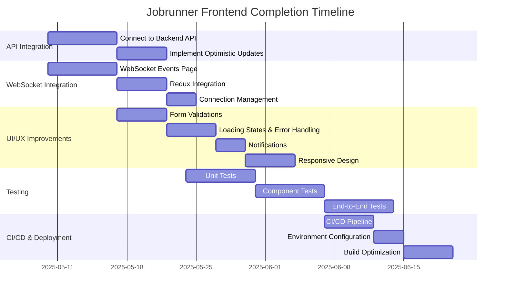
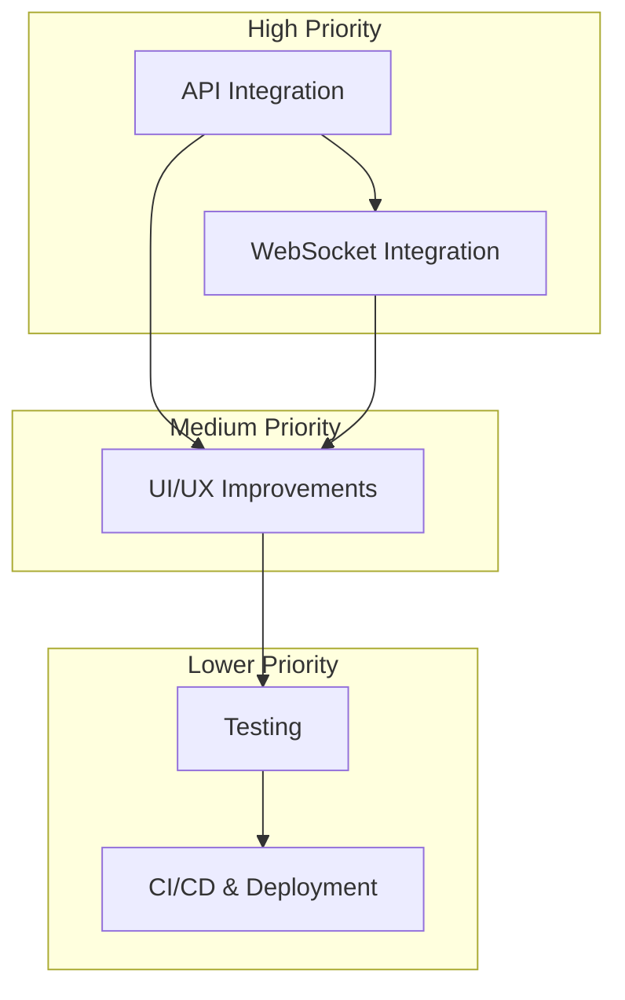

# Jobrunner Frontend Completion Plan

Based on my analysis of the codebase and our discussions, I've created a comprehensive plan to complete the functionality of the Jobrunner frontend. This plan outlines the pending tasks required to transform the current mock implementation into a fully functional application.

## 1. API Integration

### 1.1 Connect Frontend to Backend API
- Replace mock data with actual API calls in all feature areas:
  - Jobs management
  - Scheduler management
  - Webhooks management
  - API Keys management
- Implement proper error handling for all API calls
- Add loading states during API requests
- Handle authentication correctly (both JWT tokens and API keys)

### 1.2 Implement Optimistic Updates
- Update UI immediately before API calls complete
- Sync with actual response when it returns
- Handle error cases gracefully with rollback mechanisms

## 2. Real-time Updates via WebSockets

### 2.1 WebSocket Events Page
- Create a dedicated page for WebSocket events visualization
- Implement color-coded event types (job events, webhook events, system events)
- Add expandable JSON payloads for detailed event inspection
- Display connection status indicators
- Implement event filtering capabilities

### 2.2 Redux Integration
- Update Redux store automatically based on WebSocket events
- Reflect job status changes in real-time across the application
- Implement proper event handling for different event types

### 2.3 Connection Management
- Implement reconnection logic for WebSocket disconnections
- Add visual indicators for connection status
- Handle authentication for WebSocket connections

## 3. UI/UX Improvements

### 3.1 Form Validations
- Implement Zod schemas for form validation as specified in the implementation plan
- Add client-side validation for all forms:
  - Job submission form
  - Scheduler form
  - Webhook configuration form
  - API key creation form

### 3.2 Loading States & Error Handling
- Add loading indicators for all API calls
- Implement user-friendly error messages
- Create consistent error handling patterns across the application

### 3.3 Notifications
- Implement toast notifications for important events:
  - Job completion
  - Webhook deliveries
  - Error notifications
  - System events

### 3.4 Responsive Design
- Improve mobile responsiveness for all pages
- Ensure proper layout on different screen sizes
- Optimize touch interactions for mobile devices

## 4. Testing & Quality Assurance

### 4.1 Unit Tests
- Implement unit tests for all Redux slices:
  - Auth slice
  - Jobs slice
  - Scheduler slice
  - Webhooks slice
  - API Keys slice
  - WebSocket slice
- Add tests for utility functions and hooks

### 4.2 Component Tests
- Create tests for key UI components using React Testing Library
- Test form validations and user interactions
- Ensure components render correctly with different props

### 4.3 End-to-End Tests
- Set up end-to-end tests for critical user flows:
  - Authentication (login/logout)
  - Job submission and monitoring
  - Webhook configuration
  - API key management

## 5. CI/CD & Deployment

### 5.1 CI/CD Pipeline
- Set up GitHub Actions for automated testing and deployment
- Configure build processes for different environments
- Implement automated code quality checks

### 5.2 Environment Configuration
- Create environment-specific configurations:
  - Development
  - Staging
  - Production
- Set up appropriate API endpoints for each environment

### 5.3 Build Optimization
- Implement code splitting for better performance
- Add lazy loading for non-critical components
- Optimize bundle size for production

## Implementation Timeline

## Dependencies and Prioritization

This plan outlines the key tasks needed to complete the Jobrunner frontend functionality. The highest priority items are the API integration and WebSocket implementation, as they form the core functionality of the application. UI/UX improvements should be implemented alongside these core features to ensure a good user experience. Testing and CI/CD setup can be completed in later phases once the core functionality is working.
