# JobRunner Frontend Implementation Plan

Based on the requirements in FRONTEND_REQUIREMENTS.md, this document outlines a comprehensive implementation plan for the JobRunner frontend application.

## 1. Technology Stack & Architecture

### Core Technologies
- **Framework**: React with TypeScript
- **Build Tool**: Vite
- **State Management**: 
  - Redux for global application state
  - SWR for API data fetching and caching
- **Styling**: TailwindCSS with Shadcn UI components
- **Icons**: Lucide React
- **Routing**: React Router V7
- **Real-time Communication**: Socket.IO client
- **Form Handling**: React Hook Form with Zod validation
- **Testing**: Vitest with React Testing Library
- **Code Quality**: ESLint, Prettier

### Architecture Overview

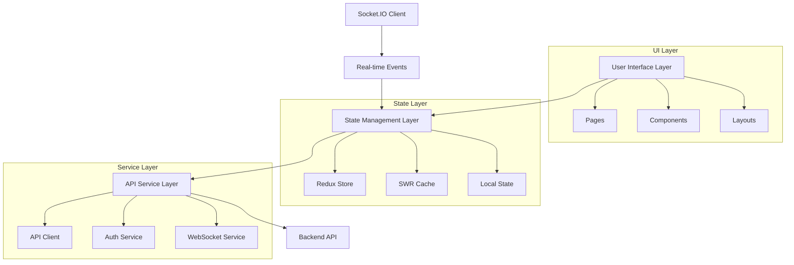

### Project Structure

```
jobs-client/
├── public/
│   ├── favicon.ico
│   └── assets/
├── src/
│   ├── app/
│   │   ├── store.ts                # Redux store configuration
│   │   └── hooks.ts                # Custom Redux hooks
│   ├── assets/
│   │   └── images/
│   ├── components/
│   │   ├── ui/                     # Shadcn UI components
│   │   ├── common/                 # Shared components
│   │   ├── auth/                   # Authentication components
│   │   ├── jobs/                   # Job-related components
│   │   ├── scheduler/              # Job scheduling components
│   │   ├── webhooks/               # Webhook components
│   │   ├── api-keys/               # API key components
│   │   ├── dashboard/              # Dashboard components
│   │   └── websocket/              # WebSocket components
│   ├── features/
│   │   ├── auth/                   # Auth slice, reducers, actions
│   │   ├── jobs/                   # Jobs slice, reducers, actions
│   │   ├── scheduler/              # Scheduler slice, reducers, actions
│   │   ├── webhooks/               # Webhooks slice, reducers, actions
│   │   ├── apiKeys/                # API keys slice, reducers, actions
│   │   └── admin/                  # Admin slice, reducers, actions
│   ├── hooks/                      # Custom hooks
│   │   ├── useAuth.ts
│   │   ├── useJobs.ts
│   │   ├── useWebsocket.ts
│   │   └── ...
│   ├── layouts/                    # Layout components
│   │   ├── MainLayout.tsx
│   │   ├── AuthLayout.tsx
│   │   └── DashboardLayout.tsx
│   ├── lib/                        # Utility libraries
│   │   ├── api.ts                  # API client
│   │   ├── socket.ts               # Socket.IO client
│   │   └── validation.ts           # Validation schemas
│   ├── pages/                      # Page components
│   │   ├── auth/
│   │   ├── dashboard/
│   │   ├── jobs/
│   │   ├── scheduler/
│   │   ├── webhooks/
│   │   ├── api-keys/
│   │   └── admin/
│   ├── services/                   # Service layer
│   │   ├── authService.ts
│   │   ├── jobService.ts
│   │   ├── schedulerService.ts
│   │   ├── webhookService.ts
│   │   └── apiKeyService.ts
│   ├── styles/                     # Global styles
│   │   └── globals.css
│   ├── types/                      # TypeScript type definitions
│   │   ├── api.ts
│   │   ├── auth.ts
│   │   ├── job.ts
│   │   └── ...
│   ├── utils/                      # Utility functions
│   │   ├── formatters.ts
│   │   ├── storage.ts
│   │   └── errorHandlers.ts
│   ├── App.tsx                     # Main App component
│   ├── main.tsx                    # Entry point
│   └── routes.tsx                  # Route definitions
├── .eslintrc.js
├── .prettierrc
├── index.html
├── package.json
├── tailwind.config.js
├── tsconfig.json
└── vite.config.ts
```

## 2. Feature Implementation Plan

### 2.1 Authentication System

#### Components & Pages
- `LoginPage`: User login form with username/password
- `RegisterPage`: User registration form
- `AuthLayout`: Layout for auth pages with branding
- `ProtectedRoute`: HOC to protect routes requiring authentication
- `AuthProvider`: Context provider for auth state

#### State Management
- Redux slice for auth state (user info, auth status)
- Local storage for token persistence
- SWR for user profile data

#### Implementation Details
- JWT token storage in localStorage/cookies with proper security
- Token refresh mechanism before expiration
- Automatic redirection to login for unauthorized requests
- Logout functionality with token invalidation

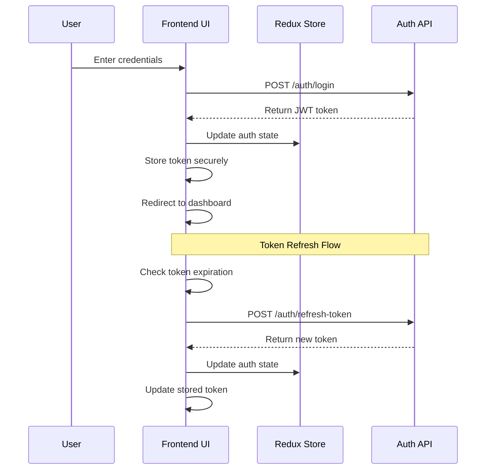

### 2.2 Job Management

#### Components & Pages
- `JobsPage`: Main page for job listing and management
- `JobSubmitForm`: Form for submitting new jobs
- `JobDetailPage`: Detailed view of a specific job
- `JobCard`: Card component for job summary in lists
- `JobStatusBadge`: Visual indicator for job status
- `JobProgressBar`: Progress visualization for active jobs
- `JobFilters`: Filtering options for job lists

#### State Management
- Redux slice for job submission form state
- SWR for job listing and details with caching and revalidation
- Local state for UI interactions

#### Implementation Details
- Job submission form with validation
- Real-time job status updates via WebSocket
- Filtering and sorting options for job lists
- Detailed job view with progress tracking
- Error handling and retry mechanisms

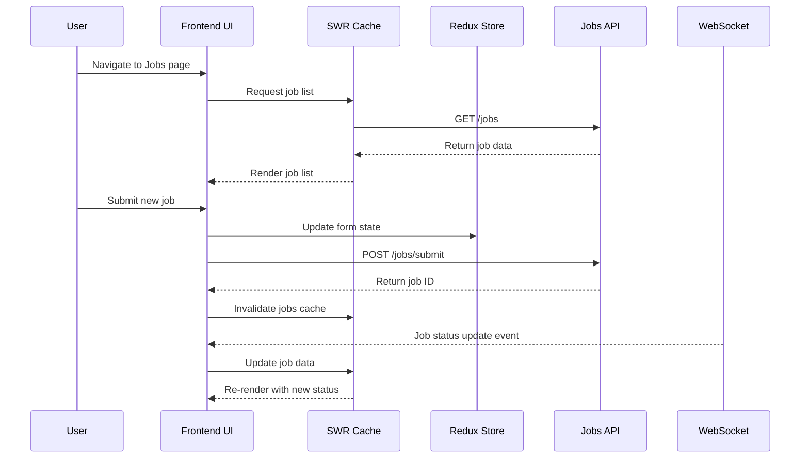

### 2.3 Job Scheduling

#### Components & Pages
- `SchedulerPage`: Main page for scheduled jobs
- `ScheduleJobForm`: Form for creating scheduled jobs
- `ScheduledJobTable`: Table view of all scheduled jobs
- `CronExpressionBuilder`: UI for building cron expressions
- `ScheduleStatusToggle`: Toggle for enabling/disabling schedules

#### State Management
- Redux slice for scheduler form state
- SWR for scheduled jobs data

#### Implementation Details
- Cron expression builder with validation and preview
- Schedule management (view, create, delete)
- Next run time display and calculation
- Status toggles for enabling/disabling schedules

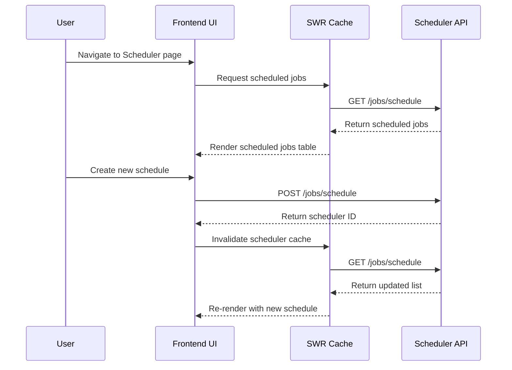

### 2.4 Webhooks Management

#### Components & Pages
- `WebhooksPage`: Main page for webhook management
- `WebhookForm`: Form for creating/editing webhooks
- `WebhookCard`: Card view for webhook display
- `WebhookEventSelector`: UI for selecting webhook events
- `WebhookHistoryViewer`: View webhook delivery history

#### State Management
- Redux slice for webhook form state
- SWR for webhooks data

#### Implementation Details
- Webhook creation with URL validation
- Event type selection with badges
- Webhook testing functionality
- Status indicators for webhook health
- Security masking for sensitive URL parts

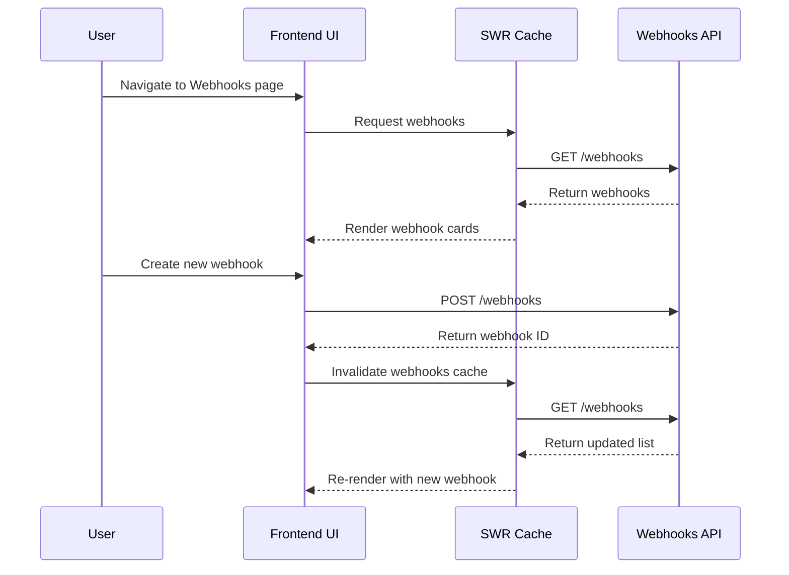

### 2.5 API Keys Management

#### Components & Pages
- `ApiKeysPage`: Main page for API key management
- `ApiKeyForm`: Form for creating new API keys
- `ApiKeyTable`: Table view of all API keys
- `ApiKeyPermissionSelector`: UI for selecting permissions
- `ApiKeyDisplay`: Secure display of API key with copy function

#### State Management
- Redux slice for API key form state
- SWR for API keys data

#### Implementation Details
- API key generation with permission scoping
- Secure display with partial masking
- Copy to clipboard functionality
- Revocation capability
- Last used tracking display

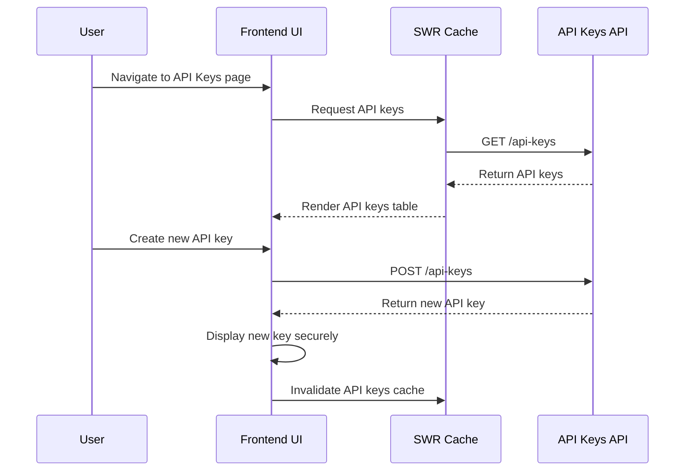

### 2.6 Admin Dashboard

#### Components & Pages
- `AdminDashboard`: Main admin dashboard page
- `SystemStatsCards`: Cards showing system statistics
- `ActiveJobsMonitor`: Real-time monitor for active jobs
- `UserActivityLog`: Log of recent user activities
- `SystemHealthIndicators`: System health status display

#### State Management
- SWR for dashboard data with frequent revalidation
- Redux for admin settings

#### Implementation Details
- Real-time statistics with auto-refresh
- Interactive charts and graphs
- Filterable activity logs
- System health monitoring

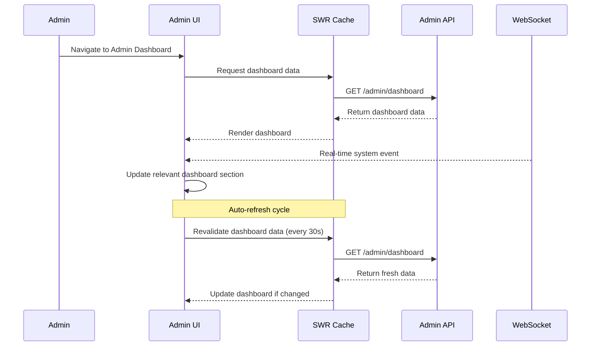

### 2.7 WebSocket Integration

#### Components
- `WebSocketProvider`: Context provider for WebSocket connection
- `ConnectionIndicator`: Visual indicator of WebSocket connection status
- `EventStream`: Real-time event display component
- `EventFilter`: UI for filtering WebSocket events

#### State Management
- Redux slice for WebSocket connection state
- Redux for event history

#### Implementation Details
- WebSocket connection with authentication
- Automatic reconnection logic
- Event filtering by category
- Real-time updates for job status
- Animated indicators for connection status

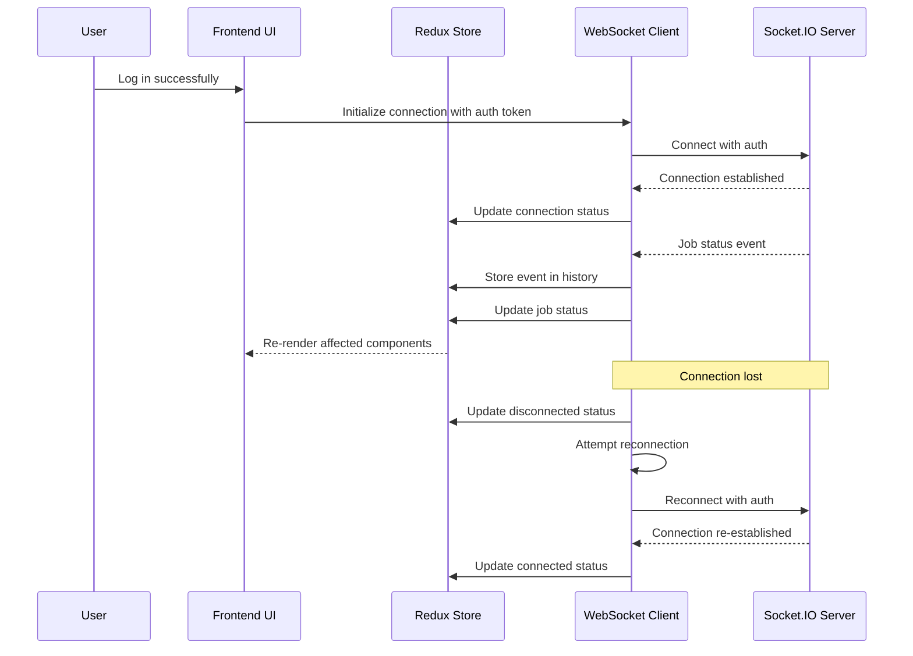

## 3. UI/UX Design System

### Design Principles
- Clean, professional appearance with modern design elements
- Consistent color scheme with blue accent colors
- Responsive layouts that adapt to different screen sizes
- Clear visual hierarchy and intuitive navigation
- Interactive elements with appropriate feedback
- Status indicators with semantic colors

### Component Design System
- **Typography**: Hierarchical type system with clear heading levels
- **Colors**: 
  - Primary: Blue (#3B82F6)
  - Success: Green (#10B981)
  - Warning: Yellow (#F59E0B)
  - Error: Red (#EF4444)
  - Neutral: Slate grays
- **Spacing**: Consistent 4px/8px grid system
- **Shadows**: Subtle elevation system for cards and modals
- **Animations**: Subtle transitions for state changes
- **Status Indicators**:
  - Green for success/completed
  - Blue for active
  - Yellow for delayed
  - Orange for paused
  - Purple for waiting-children
  - Red for failed

### Responsive Design Strategy
- Mobile-first approach with progressive enhancement
- Breakpoints at standard device sizes
- Flexible layouts using CSS Grid and Flexbox
- Adaptive navigation (sidebar on desktop, bottom bar on mobile)
- Touch-friendly controls on mobile devices

## 4. State Management Strategy

### Redux Store Structure

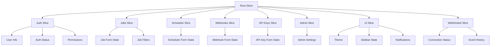

### SWR Data Fetching Strategy
- Cache invalidation on mutations
- Optimistic updates for better UX
- Automatic revalidation on focus
- Error retry mechanism
- Pagination support for large data sets
- Prefetching for anticipated data needs

### Data Flow Patterns
- Unidirectional data flow for predictable state management
- Command pattern for API interactions
- Observer pattern for WebSocket events
- Repository pattern for data access abstraction

## 5. Authentication & Security

### Authentication Methods

#### Username/Password Authentication
- Standard login form with username and password fields
- JWT token generation upon successful authentication
- Token storage in secure browser storage
- Token refresh mechanism before expiration

#### API Key Authentication
- Support for API key-based authentication as an alternative to username/password
- API key input form for programmatic access
- API key validation and permission verification
- Secure storage and transmission of API keys

### API Key Management UI

- **API Key Creation Interface**:
  - Form for generating new API keys with specific permissions
  - Permission selection UI with clear descriptions
  - Optional expiration date setting
  - Purpose/description field for key identification

- **API Key Display**:
  - Secure display of newly generated keys with copy-to-clipboard functionality
  - Warning that the full key will only be shown once
  - Partial masking of keys in the management interface (e.g., `ak_****1234`)

- **API Key Usage Interface**:
  - Dedicated section for developers with API usage examples
  - Code snippets showing how to use API keys in different programming languages
  - Documentation on required headers and authentication format

### API Key Implementation Details

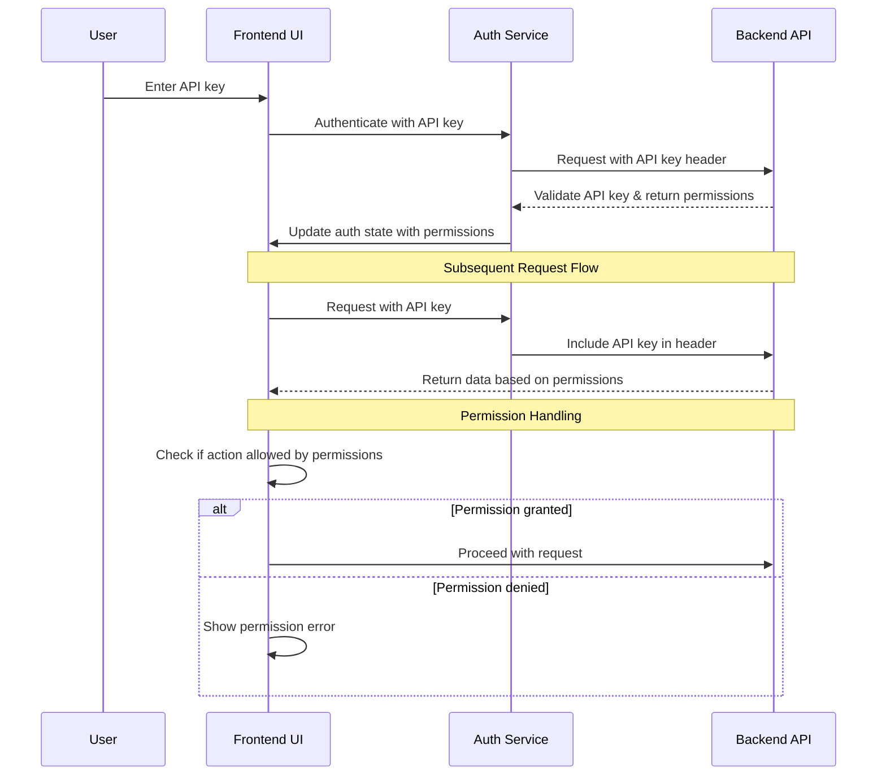

### API Key Security Considerations

- **Storage**:
  - Never store full API keys in browser storage
  - For developer tools, store keys in session only
  - Clear keys from memory when not in use

- **Transmission**:
  - Always use HTTPS for API key transmission
  - Include API keys in headers rather than URL parameters
  - Use standard `Authorization: Bearer <api-key>` format

- **UI Security**:
  - Mask API keys in UI displays
  - Implement copy functionality without revealing full key
  - Provide clear security guidelines for API key usage

- **Permission Enforcement**:
  - Client-side permission checking to prevent unauthorized UI actions
  - Clear indication of available actions based on API key permissions
  - Graceful handling of permission-denied responses

### Combined Authentication Strategy

- **Authentication Selection**:
  - Toggle between username/password and API key authentication methods
  - Clear UI indication of current authentication method
  - Different UI flows for human users vs programmatic access

- **Permission Handling**:
  - Unified permission model across authentication methods
  - UI adaptation based on available permissions
  - Permission-based feature visibility

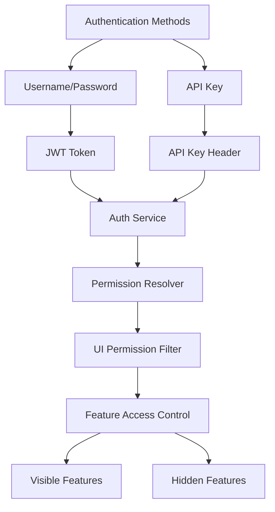

### Authentication Flow

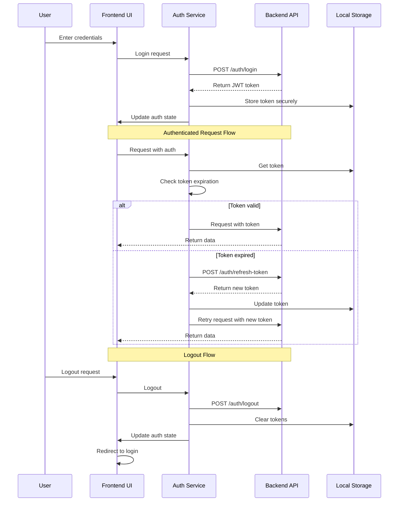

### Security Measures
- Secure token storage with proper expiration
- CSRF protection
- XSS prevention through proper content sanitization
- API key partial masking in UI
- Permission-based access control
- Secure WebSocket connection with authentication

## 6. Real-time Updates Implementation

### WebSocket Integration

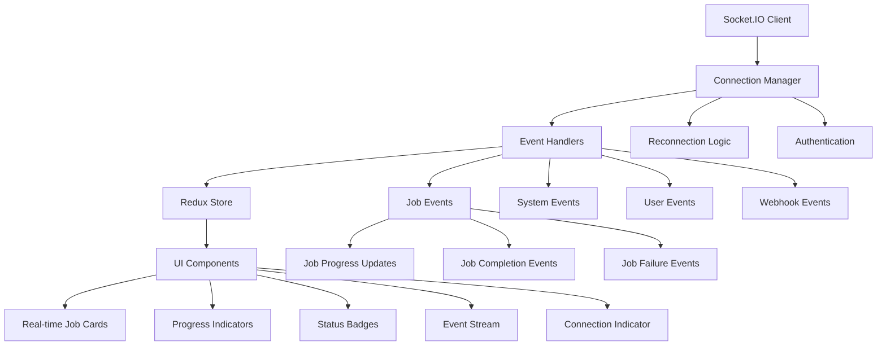

### Polling Strategy (Fallback)
- Intelligent polling for critical data
- Exponential backoff for failed requests
- Polling frequency based on data volatility
- Automatic switch to polling if WebSocket fails

## 7. Error Handling & Resilience

### Error Handling Strategy
- Centralized error handling through API client
- Typed error responses for predictable handling
- User-friendly error messages
- Detailed logging for debugging
- Retry mechanism for transient failures

### Resilience Patterns
- Circuit breaker for failing services
- Fallback mechanisms for critical features
- Graceful degradation of non-essential features
- Offline support where applicable
- Recovery mechanisms for interrupted operations

## 8. Performance Optimization

### Performance Strategies
- Code splitting for reduced initial load time
- Lazy loading of non-critical components
- Memoization of expensive computations
- Virtualized lists for large data sets
- Image optimization and lazy loading
- Bundle size optimization

### Monitoring & Metrics
- Performance monitoring with web vitals
- Error tracking
- User interaction analytics
- Resource usage monitoring
- API response time tracking

## 9. Implementation Phases

### Phase 1: Foundation & Authentication (2 weeks)
- Project setup and configuration
- Core UI components and layouts
- Authentication system implementation
- Basic routing and navigation

### Phase 2: Job Management (2 weeks)
- Job submission form
- Job listing and filtering
- Job details view
- WebSocket integration for real-time updates

### Phase 3: Scheduling & Webhooks (2 weeks)
- Job scheduling implementation
- Cron expression builder
- Webhook management
- Event stream visualization

### Phase 4: API Keys & Admin (2 weeks)
- API key management
- Admin dashboard
- System statistics
- User activity monitoring

### Phase 5: Polish & Optimization (1 week)
- UI/UX refinements
- Performance optimization
- Comprehensive testing
- Documentation

## 10. Testing Strategy

### Testing Approach
- Unit tests for utility functions and hooks
- Component tests for UI components
- Integration tests for feature workflows
- E2E tests for critical user journeys
- Accessibility testing

### Test Coverage Targets
- 80%+ coverage for utility functions
- 70%+ coverage for components
- 60%+ coverage for integration tests
- Critical user journeys covered by E2E tests

## 11. Deployment & CI/CD

### Build Process
- Optimized production builds with Vite
- Environment-specific configurations
- Static asset optimization
- Bundle analysis and optimization

### CI/CD Pipeline
- Automated testing on pull requests
- Linting and type checking
- Build verification
- Automated deployment to staging/production

## 12. Documentation

### Developer Documentation
- Component API documentation
- State management patterns
- API integration guide
- Testing guidelines

### User Documentation
- User guides for each feature
- FAQ section
- Troubleshooting guide
- Video tutorials for complex workflows