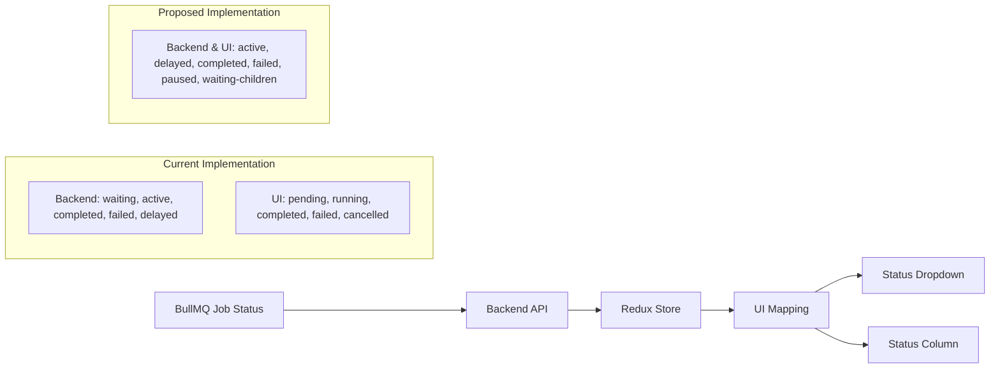

Based on my analysis of the code, I've identified the following:

1. **BullMQ Job Statuses**:
   - From the task description, BullMQ has the following valid job statuses: 'active', 'delayed', 'completed', 'failed', 'paused', 'waiting-children'

2. **Backend Implementation**:
   - In `src/routes/jobs.ts`, line 151, the backend uses these statuses: 'completed', 'failed', 'active', 'waiting', 'delayed'
   - In the API documentation (`src/docs/routes/job-routes.ts` and `src/docs/schemas/job-schema.ts`), the job statuses are defined as: 'waiting', 'active', 'completed', 'failed', 'delayed'

3. **Frontend Implementation**:
   - In `jobs-client/src/features/jobs/jobsSlice.ts`, line 9, the Job interface defines statuses as: 'waiting' | 'active' | 'completed' | 'failed' | 'delayed'
   - In `jobs-client/src/pages/jobs/JobsPage.tsx`, the UI maps these statuses to: 'pending', 'running', 'completed', 'failed', 'cancelled'
   - The dropdown in `JobsPage.tsx` (lines 357-363) shows: 'All', 'Pending', 'Running', 'Completed', 'Failed', 'Cancelled'

4. **Inconsistencies**:
   - The backend and Redux store use BullMQ statuses: 'waiting', 'active', 'completed', 'failed', 'delayed'
   - The UI dropdown and status column use different terms: 'pending', 'running', 'completed', 'failed', 'cancelled'
   - The task mentions BullMQ statuses including 'paused' and 'waiting-children', which aren't used in the current implementation

5. **Mapping Logic**:
   - In `JobsPage.tsx`, there are two mapping functions that convert backend statuses to UI statuses:
     - `mapApiJobToUiJob` (lines 60-111)
     - The status mapping in the real-time update effect (lines 167-195)
   - Both functions map:
     - 'waiting' → 'pending'
     - 'active' → 'running'
     - 'completed' → 'completed'
     - 'failed' → 'failed'
     - 'delayed' → 'pending'
   - There's no mapping for 'paused' or 'waiting-children'
   - There's no mapping to 'cancelled' (which appears in the dropdown)

The task is to ensure consistency between the dropdown and status column. The issue is that we need to align the frontend dropdown options with the actual BullMQ statuses while maintaining a user-friendly UI.

# Job Status Consistency Analysis and Plan

After analyzing the codebase, I've identified inconsistencies between BullMQ's job statuses and how they're displayed in the frontend. Let me outline the current state and propose a solution.

## Current Implementation

### BullMQ Statuses (Backend)
According to the task description, BullMQ supports these statuses:
- 'active'
- 'delayed'
- 'completed'
- 'failed'
- 'paused'
- 'waiting-children'

### Backend Implementation
In `src/routes/jobs.ts` and API documentation, the backend uses:
- 'waiting'
- 'active'
- 'completed'
- 'failed'
- 'delayed'

### Frontend Redux Store
In `jobsSlice.ts`, the Job interface defines:
```typescript
status: 'waiting' | 'active' | 'completed' | 'failed' | 'delayed';
```

### Frontend UI
In `JobsPage.tsx`, the dropdown shows:
- 'All'
- 'Pending'
- 'Running'
- 'Completed'
- 'Failed'
- 'Cancelled'

And the status column displays these same UI-friendly terms.

## The Problem

1. The frontend dropdown and status column use user-friendly terms that don't directly match BullMQ's status names
2. There's a mapping in the code that converts backend statuses to UI statuses:
   - 'waiting' → 'pending'
   - 'active' → 'running'
   - 'completed' → 'completed'
   - 'failed' → 'failed'
   - 'delayed' → 'pending'
3. Some BullMQ statuses ('paused', 'waiting-children') aren't handled in the frontend
4. The UI shows 'cancelled' status, but there's no direct mapping from a BullMQ status

## Proposed Solution

To ensure consistency, we should:

1. Update the frontend dropdown to use the exact BullMQ status names
2. Update the status column to display the same BullMQ status names
3. Add support for the missing BullMQ statuses ('paused', 'waiting-children')
4. Remove the 'cancelled' status if it's not a valid BullMQ status, or map it correctly if it is

### Implementation Plan

1. **Update the Job Interface**: Modify the Job interface in `jobsSlice.ts` to include all valid BullMQ statuses
2. **Update the UI Job Interface**: Modify the UIJob interface in `JobsPage.tsx` to use the same status names
3. **Update the Status Dropdown**: Change the dropdown options to match BullMQ status names
4. **Update the Status Mapping**: Modify the mapping functions to handle all BullMQ statuses correctly
5. **Update the Status Display**: Ensure the status column displays the correct status names

## Mermaid Diagram: Status Flow



Would you like me to proceed with implementing this solution? Or would you prefer a different approach to maintaining consistency between the dropdown and status column?

I've analyzed the code and found inconsistencies between BullMQ's job statuses and how they're displayed in the frontend. Would you prefer to:

1. Update the frontend to use the exact BullMQ status names ('active', 'delayed', 'completed', 'failed', 'paused', 'waiting-children') in both the dropdown and status column?

2. Keep the user-friendly terms in the UI but ensure they consistently map to BullMQ statuses?

3. Use a hybrid approach with technical terms but with better formatting (e.g., "Active" instead of "active", "Waiting Children" instead of "waiting-children")?