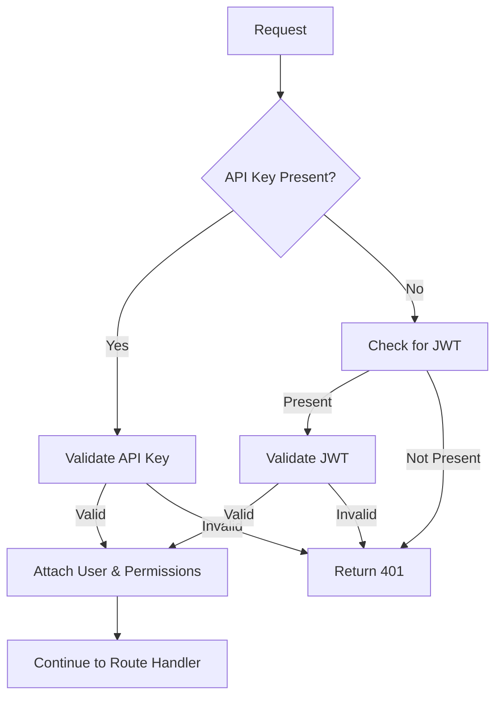

# Implementation Plan: Adding API Key Authentication

## Overview

This plan outlines how to extend the current backend to support API key authentication alongside the existing JWT authentication system. API keys will provide an alternative authentication method, particularly useful for machine-to-machine communication, third-party integrations, and automated scripts.

## 1. Database Schema Updates

### 1.1 Add API Key Table to Prisma Schema

```prisma
model ApiKey {
  id          Int       @id @default(autoincrement())
  userId      Int
  name        String    // A descriptive name for the API key
  key         String    @unique // The actual API key (hashed)
  prefix      String    @unique // First few characters of the key (for display)
  permissions String[]  // Array of permissions granted to this key
  lastUsed    DateTime?
  createdAt   DateTime  @default(now())
  expiresAt   DateTime?
  isActive    Boolean   @default(true)
  
  user        User      @relation(fields: [userId], references: [id])
}
```

### 1.2 Update User Model

```prisma
model User {
  // Existing fields...
  apiKeys     ApiKey[]
}
```

## 2. API Key Service Implementation

Create a new service file: `src/services/apiKeyService.ts`

```typescript
// Key functionality to implement:
// - generateApiKey(userId, name, permissions, expiresAt?)
// - validateApiKey(key)
// - listApiKeys(userId)
// - revokeApiKey(keyId, userId)
// - updateApiKey(keyId, userId, updates)
```

### 2.1 API Key Generation

```typescript
async function generateApiKey(userId: number, name: string, permissions: string[], expiresAt?: Date): Promise<{ key: string, prefix: string }> {
  // Generate a secure random API key
  // Hash the key for storage
  // Store only the prefix for display purposes
  // Return the full key to the user (only shown once)
}
```

### 2.2 API Key Validation

```typescript
async function validateApiKey(key: string): Promise<{ userId: number, permissions: string[] } | null> {
  // Find the API key in the database
  // Check if it's active and not expired
  // Update lastUsed timestamp
  // Return user ID and permissions if valid
}
```

## 3. Authentication Middleware

### 3.1 Create API Key Authentication Middleware

Create a new file: `src/middleware/apiKeyAuth.ts`

```typescript
import { Request, Response, NextFunction } from 'express';
import { logger } from '@ugm/logger';
import apiKeyService from '../services/apiKeyService.js';

export const authenticateApiKey = async (req: Request, res: Response, next: NextFunction) => {
  // Extract API key from header (X-API-Key)
  // Validate the API key
  // Attach user and permissions to request object
  // Call next() if valid, return 401 if invalid
};
```

### 3.2 Create Combined Authentication Middleware

Create a new file: `src/middleware/combinedAuth.ts`

```typescript
import { Request, Response, NextFunction } from 'express';
import { authenticateToken } from './auth.js';
import { authenticateApiKey } from './apiKeyAuth.js';

export const authenticate = async (req: Request, res: Response, next: NextFunction) => {
  // Check for API key first
  // If no API key, fall back to JWT authentication
  // This allows either method to work
};
```

## 4. Route Updates

### 4.1 Update Route Registration

Modify `src/routes/index.ts` to use the new combined authentication middleware:

```typescript
import { authenticate } from '../middleware/combinedAuth.js';

// Replace authenticateToken with authenticate in all protected routes
```

### 4.2 Add API Key Management Routes

Create a new file: `src/routes/apiKeys.ts`

```typescript
// Implement routes for:
// - GET /api-keys - List all API keys for the authenticated user
// - POST /api-keys - Create a new API key
// - DELETE /api-keys/:id - Revoke an API key
// - PUT /api-keys/:id - Update an API key (name, permissions, etc.)
```

Register the new routes in `src/routes/index.ts`:

```typescript
import apiKeyRoutes from './apiKeys.js';

// In registerRoutes function:
app.use('/api-keys', authenticate, apiKeyRoutes);
```

## 5. User Interface Updates (Optional)

If there's a frontend application, update it to:
- Add API key management UI
- Display API keys with their prefixes
- Show the full API key only once upon creation
- Allow revoking and creating new keys

## 6. Documentation Updates

Update API documentation to include:
- How to use API keys for authentication
- API key management endpoints
- Best practices for API key security

## 7. Implementation Steps

1. **Database Migration**
   - Update Prisma schema
   - Generate and run migration

2. **Service Implementation**
   - Implement apiKeyService.ts
   - Add unit tests

3. **Middleware Implementation**
   - Implement apiKeyAuth.ts
   - Implement combinedAuth.ts
   - Add unit tests

4. **Route Implementation**
   - Create apiKeys.ts routes
   - Update existing routes to use combined authentication
   - Add integration tests

5. **Security Review**
   - Ensure API keys are properly hashed
   - Validate rate limiting and monitoring
   - Review error messages to prevent information leakage

## 8. Security Considerations

- Store API keys hashed in the database (using bcrypt or similar)
- Only show the full API key once when generated
- Implement rate limiting for API key usage
- Add monitoring and alerting for suspicious API key activity
- Allow setting expiration dates on API keys
- Support fine-grained permissions for API keys
- Implement automatic rotation policies

## 9. Testing Plan

1. **Unit Tests**
   - Test API key generation and validation
   - Test authentication middleware

2. **Integration Tests**
   - Test API key management endpoints
   - Test authentication with both JWT and API keys

3. **Security Tests**
   - Test rate limiting
   - Test expired and revoked keys
   - Test permission enforcement

## 10. Rollout Plan

1. Deploy database migrations
2. Deploy new code with API key support
3. Initially make API keys opt-in for users
4. Monitor API key usage and performance
5. Gradually encourage API key usage for automated integrations

## Authentication Flow



## API Key Data Model

```mermaid
erDiagram
    User ||--o{ ApiKey : has
    ApiKey {
        int id
        int userId
        string name
        string key
        string prefix
        string[] permissions
        datetime lastUsed
        datetime createdAt
        datetime expiresAt
        boolean isActive
    }
    }
```
