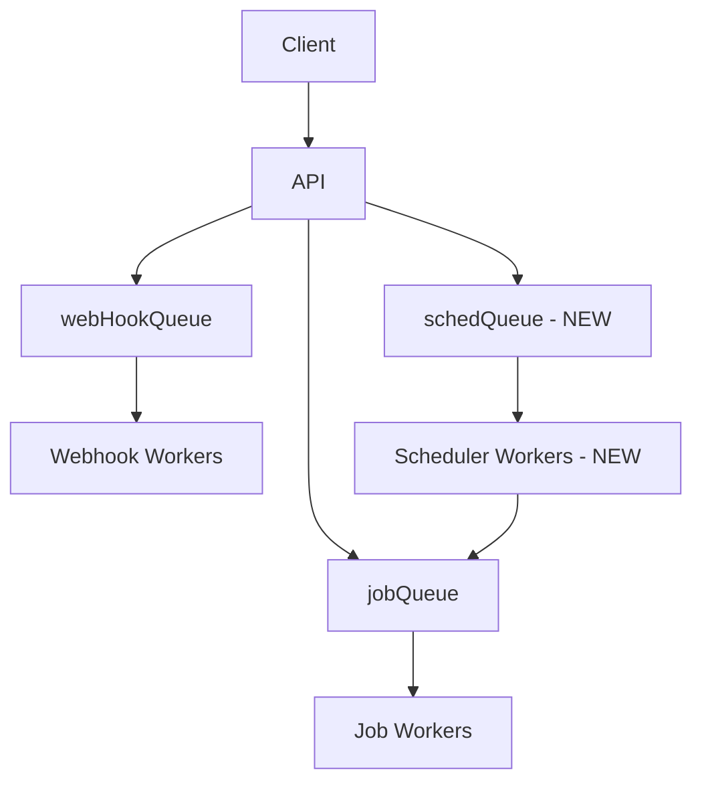

# Scheduled Jobs Implementation Plan

## Overview

We need to add a new feature to the application that allows users to schedule jobs for future execution using BullMQ's JobScheduler. This will involve:

1. Creating a new queue for scheduled jobs
2. Implementing the JobScheduler functionality
3. Adding a new API endpoint for submitting scheduled jobs
4. Updating the UI to support scheduled job submission
5. Implementing workers to process scheduled jobs

## Current System Architecture

The current system uses BullMQ for job processing with the following components:

- `jobQueue`: Main queue for processing jobs
- `webHookQueue`: Queue for webhook notifications
- Express routes for job submission and management
- Socket.IO for real-time job updates
- Workers for processing jobs and webhooks

## Implementation Plan

### 1. Create a New Queue for Scheduled Jobs

We'll add a new queue called `schedQueue` in the Bull configuration:



### 2. Update Bull Configuration

We'll update the `bull.ts` file to include the new `schedQueue` and configure the JobScheduler:

```typescript
// Add to bull.ts
import { Queue, QueueEvents, JobScheduler } from 'bullmq';

// Initialize queues
export const jobQueue = new Queue('jobQueue', { connection: redisOptions });
export const webHookQueue = new Queue('webhooks', { connection: redisOptions });
export const schedQueue = new Queue('schedQueue', { connection: redisOptions });

// Initialize JobScheduler
export const jobScheduler = new JobScheduler('schedQueue', { connection: redisOptions });

// Update Bull Board
export const bullBoard = createBullBoard({
  queues: [
    new BullMQAdapter(jobQueue),
    new BullMQAdapter(webHookQueue),
    new BullMQAdapter(schedQueue)
  ],
  serverAdapter: serverAdapter,
});
```

### 3. Create Scheduler Service

We'll create a new service to handle scheduled job operations:

```typescript
// src/services/schedulerService.ts
import { logger } from '@ugm/logger';
import { jobScheduler, jobQueue, defaultOptions } from '../config/bull';

export interface ScheduleOptions {
  cron?: string;        // Cron expression (e.g., "0 0 * * *" for daily at midnight)
  repeat?: {
    every?: number;     // Repeat every n milliseconds
    limit?: number;     // Maximum number of repetitions
  };
  startDate?: Date;     // When to start the job
  endDate?: Date;       // When to stop scheduling the job
  tz?: string;          // Timezone for cron expressions
}

export interface ScheduledJobSubmission {
  name: string;         // Job name
  data: any;            // Job data
  schedule: ScheduleOptions; // Scheduling options
  options?: any;        // Job options (same as regular jobs)
}

class SchedulerService {
  /**
   * Schedule a new job
   */
  async scheduleJob(submission: ScheduledJobSubmission, userId: number): Promise<string> {
    logger.info(`Scheduling job: ${submission.name} for user ${userId}`);
    
    // Add user ID to job data
    const jobData = {
      ...submission.data,
      userId
    };
    
    // Use provided options or default options
    const options = submission.options || defaultOptions;
    
    // Create a unique ID for the scheduler
    const schedulerId = `${userId}-${submission.name}-${Date.now()}`;
    
    // Extract scheduling options
    const { cron, repeat, startDate, endDate, tz } = submission.schedule;
    
    // Create repeat options for the scheduler
    const repeatOpts: any = {};
    
    if (cron) {
      repeatOpts.pattern = cron;
      if (tz) repeatOpts.tz = tz;
    } else if (repeat?.every) {
      repeatOpts.every = repeat.every;
      if (repeat.limit) repeatOpts.limit = repeat.limit;
    }
    
    if (startDate) repeatOpts.startDate = startDate;
    if (endDate) repeatOpts.endDate = endDate;
    
    // Schedule the job
    const job = await jobScheduler.upsertJobScheduler(
      schedulerId,
      repeatOpts,
      submission.name,
      jobData,
      options,
      { override: true }
    );
    
    logger.info(`Job scheduled: ${schedulerId}`);
    return schedulerId;
  }

  /**
   * Get all scheduled jobs for a user
   */
  async getUserScheduledJobs(userId: number): Promise<any[]> {
    logger.info(`Getting scheduled jobs for user ${userId}`);
    
    // Get all schedulers
    const schedulers = await jobScheduler.getJobSchedulers();
    
    // Filter schedulers by user ID
    return schedulers.filter(scheduler => 
      scheduler.data && scheduler.data.userId === userId
    );
  }

  /**
   * Get a specific scheduled job
   */
  async getScheduledJob(schedulerId: string, userId: number): Promise<any | null> {
    logger.info(`Getting scheduled job ${schedulerId}`);
    
    const scheduler = await jobScheduler.getScheduler(schedulerId);
    
    if (!scheduler) {
      logger.warn(`Scheduled job ${schedulerId} not found`);
      return null;
    }
    
    // Ensure user can only access their own scheduled jobs
    if (scheduler.data.userId !== userId) {
      logger.warn(`Unauthorized access to scheduled job ${schedulerId} by user ${userId}`);
      return null;
    }
    
    return scheduler;
  }

  /**
   * Remove a scheduled job
   */
  async removeScheduledJob(schedulerId: string, userId: number): Promise<boolean> {
    logger.info(`Removing scheduled job ${schedulerId}`);
    
    // First check if the scheduler exists and belongs to the user
    const scheduler = await this.getScheduledJob(schedulerId, userId);
    
    if (!scheduler) {
      return false;
    }
    
    // Remove the scheduler
    await jobScheduler.removeJobScheduler(schedulerId);
    logger.info(`Scheduled job ${schedulerId} removed`);
    
    return true;
  }
}

export default new SchedulerService();
```

### 4. Create Scheduler Routes

We'll add a new route file for scheduled job operations:

```typescript
// src/routes/scheduler.ts
import { Router, Request, Response } from 'express';
import { logger } from '@ugm/logger';
import { authenticateToken } from '../middleware/auth.js';
import schedulerService from '../services/schedulerService.js';

const router = Router();

/**
 * Schedule a new job
 */
router.post('/schedule', authenticateToken, async (req: Request, res: Response) => {
  try {
    const { name, data, schedule, options } = req.body;
    const userId = req.user?.userId;
    
    if (!userId) {
      return res.status(401).json({ message: 'Not authenticated' });
    }
    
    // Validate required fields
    if (!name || !data || !schedule) {
      return res.status(400).json({ message: 'Missing required fields: name, data, or schedule' });
    }
    
    // Validate schedule options
    if (!schedule.cron && (!schedule.repeat || !schedule.repeat.every)) {
      return res.status(400).json({ 
        message: 'Invalid schedule options: must provide either cron expression or repeat.every' 
      });
    }
    
    // Schedule the job
    const schedulerId = await schedulerService.scheduleJob(
      { name, data, schedule, options },
      userId
    );
    
    res.json({ schedulerId });
  } catch (error) {
    logger.error('Error scheduling job:', error);
    res.status(500).json({ message: 'An error occurred while scheduling the job' });
  }
});

/**
 * Get all scheduled jobs for the authenticated user
 */
router.get('/schedule', authenticateToken, async (req: Request, res: Response) => {
  try {
    const userId = req.user?.userId;
    
    if (!userId) {
      return res.status(401).json({ message: 'Not authenticated' });
    }
    
    const scheduledJobs = await schedulerService.getUserScheduledJobs(userId);
    
    res.json({ scheduledJobs });
  } catch (error) {
    logger.error('Error getting scheduled jobs:', error);
    res.status(500).json({ message: 'An error occurred while fetching scheduled jobs' });
  }
});

/**
 * Get a specific scheduled job
 */
router.get('/schedule/:schedulerId', authenticateToken, async (req: Request, res: Response) => {
  try {
    const { schedulerId } = req.params;
    const userId = req.user?.userId;
    
    if (!userId) {
      return res.status(401).json({ message: 'Not authenticated' });
    }
    
    const scheduledJob = await schedulerService.getScheduledJob(schedulerId, userId);
    
    if (!scheduledJob) {
      return res.status(404).json({ message: 'Scheduled job not found' });
    }
    
    res.json(scheduledJob);
  } catch (error) {
    logger.error('Error getting scheduled job:', error);
    res.status(500).json({ message: 'An error occurred while fetching the scheduled job' });
  }
});

/**
 * Remove a scheduled job
 */
router.delete('/schedule/:schedulerId', authenticateToken, async (req: Request, res: Response) => {
  try {
    const { schedulerId } = req.params;
    const userId = req.user?.userId;
    
    if (!userId) {
      return res.status(401).json({ message: 'Not authenticated' });
    }
    
    const removed = await schedulerService.removeScheduledJob(schedulerId, userId);
    
    if (!removed) {
      return res.status(404).json({ message: 'Scheduled job not found or unauthorized' });
    }
    
    res.json({ message: 'Scheduled job removed successfully' });
  } catch (error) {
    logger.error('Error removing scheduled job:', error);
    res.status(500).json({ message: 'An error occurred while removing the scheduled job' });
  }
});

export default router;
```

### 5. Update Routes Index

We'll update the routes index to include the new scheduler routes:

```typescript
// Update src/routes/index.ts
import { Express } from 'express';
import jobRoutes from './jobs.js';
import webhookRoutes from './webhooks.js';
import adminRoutes from './admin.js';
import authRoutes from './auth.js';
import schedulerRoutes from './scheduler.js'; // Add this line

export const registerRoutes = (app: Express): void => {
  app.use('/jobs', jobRoutes);
  app.use('/webhooks', webhookRoutes);
  app.use('/admin', adminRoutes);
  app.use('/auth', authRoutes);
  app.use('/jobs', schedulerRoutes); // Add this line
};
```

## API Endpoints

The new API endpoints for scheduled jobs will be:

1. `POST /jobs/schedule` - Schedule a new job
   - Request body:
     ```json
     {
       "name": "jobName",
       "data": {
         "key1": "value1",
         "key2": "value2"
       },
       "schedule": {
         "cron": "0 0 * * *",
         "tz": "America/New_York",
         "startDate": "2025-07-01T00:00:00.000Z",
         "endDate": "2025-12-31T00:00:00.000Z"
       },
       "options": {
         "removeOnComplete": { "count": 3 },
         "removeOnFail": { "count": 5 }
       }
     }
     ```

2. `GET /jobs/schedule` - Get all scheduled jobs for the authenticated user
3. `GET /jobs/schedule/:schedulerId` - Get a specific scheduled job
4. `DELETE /jobs/schedule/:schedulerId` - Remove a scheduled job

## Implementation Steps

1. Update `bull.ts` to add the new `schedQueue` and `jobScheduler`
2. Create `schedulerService.ts` for scheduled job operations
3. Create `scheduler.ts` routes for the new API endpoints
4. Update `routes/index.ts` to include the new routes
5. Update workers to handle scheduled jobs
6. Update API documentation
7. Test the new functionality
