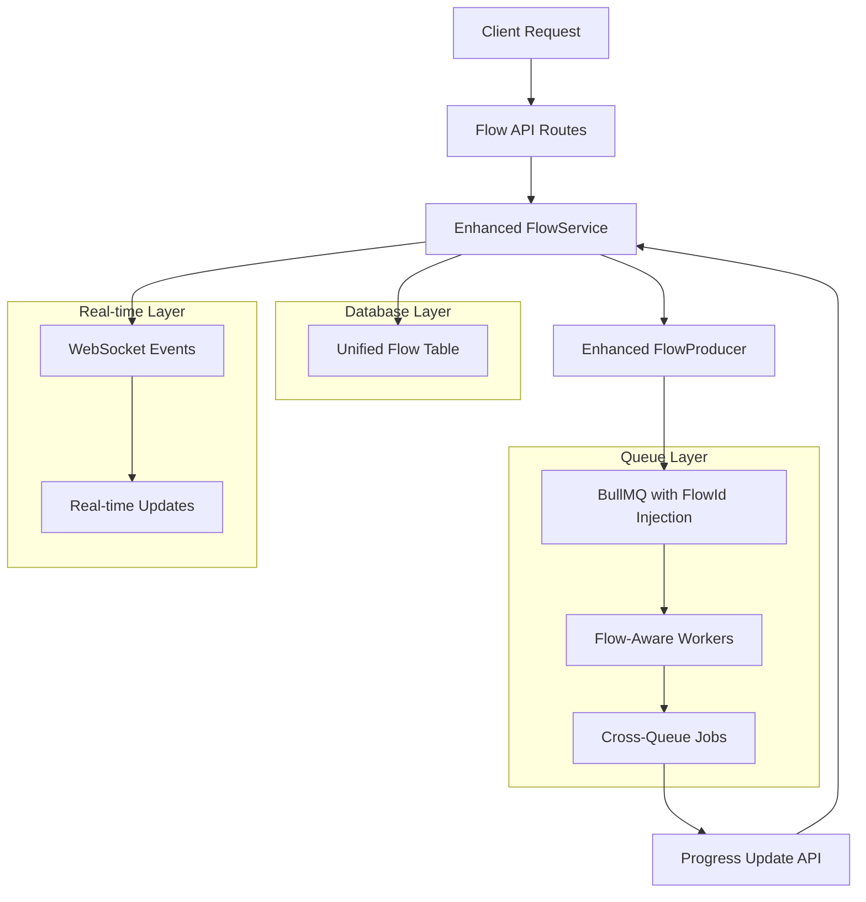

# Backend Routes `/flows` Refactor Plan

## Executive Summary

This refactor plan addresses the key objectives of simplifying flow storage, enabling cross-queue job tracking via `flowId`, combining database tables, ensuring consistent nomenclature, and introducing `flowname` for better flow identification.

## 1. Current State Analysis

### Current Issues Identified:

- **Dual Database Structure**: Separate `Flow` and `FlowJob` tables create complexity and data redundancy
- **Inconsistent Nomenclature**: Mixed usage of `id` vs `flowId` in responses
- **Limited Cross-Queue Tracking**: No mechanism for jobs in other queues to reference their parent flow
- **Complex Job Hierarchy Storage**: Recursive database operations for saving job trees
- **Missing Flow Identification**: No `flowname` field for human-readable flow identification
- **Limited Update Mechanism**: No structured way for external jobs to update flow progress

## 2. Unified Database Schema Design

### New Unified `Flow` Model

```prisma
model Flow {
  id          String    @id @default(cuid())  // Changed to String for better flowId consistency
  flowname    String                          // NEW: Human-readable flow identifier
  name        String                          // EXISTING: Handler name for root job
  queueName   String                          // Root job queue
  userId      Int
  user        User      @relation(fields: [userId], references: [id])

  // Unified job structure stored as JSON
  jobStructure Json                           // Complete hierarchical job tree
  rootJobId    String?                        // BullMQ root job ID

  // Flow-level status and metadata
  status       String    @default("pending")  // pending, running, completed, failed, cancelled
  progress     Json      @default("{}")       // Progress tracking for all jobs
  result       Json?                          // Final flow result
  error        Json?                          // Error information if failed

  // Timestamps
  createdAt    DateTime  @default(now())
  updatedAt    DateTime  @updatedAt
  startedAt    DateTime?
  completedAt  DateTime?

  @@index([userId, status])
  @@index([flowname])
}
```

### Key Schema Changes:

1. **Unified Structure**: Single table combining Flow and FlowJob data
2. **String ID**: Changed from `Int` to `String` for better `flowId` consistency
3. **New Fields**: Added `flowname`, `status`, `progress`, `startedAt`, `completedAt`
4. **JSON Storage**: `jobStructure` stores complete hierarchy, `progress` tracks individual job states

## 3. API Interface Redesign

### Request/Response Interfaces

```typescript
// Create Flow Request
interface CreateFlowRequest {
  flowname: string; // NEW: Human-readable flow name
  name: string; // Handler name for root job
  queueName: string; // Root job queue
  data?: Record<string, any>;
  opts?: Record<string, any>;
  children?: FlowJobData[];
}

// Unified Flow Response
interface FlowResponse {
  flowId: string; // Consistent naming
  flowname: string; // NEW: Human-readable identifier
  name: string; // Handler name
  queueName: string;
  status: "pending" | "running" | "completed" | "failed" | "cancelled";
  progress: {
    total: number;
    completed: number;
    failed: number;
    percentage: number;
  };
  result?: Record<string, any>;
  error?: Record<string, any>;
  createdAt: string;
  updatedAt: string;
  startedAt?: string;
  completedAt?: string;
}

// Flow Update Request (for external job updates)
interface FlowUpdateRequest {
  jobId: string; // BullMQ job ID
  status: "running" | "completed" | "failed";
  result?: Record<string, any>;
  error?: Record<string, any>;
}
```

## 4. FlowId Propagation Mechanism

### Automatic FlowId Injection

```typescript
// Enhanced FlowProducer wrapper
class EnhancedFlowProducer {
  private flowProducer: FlowProducer;

  constructor(connection: any) {
    this.flowProducer = new FlowProducer({ connection });
  }

  async add(flowJob: FlowJob, flowId: string): Promise<JobNode> {
    // Recursively inject flowId into all jobs
    const enhancedJob = this.injectFlowId(flowJob, flowId);
    return await this.flowProducer.add(enhancedJob);
  }

  private injectFlowId(job: FlowJob, flowId: string): FlowJob {
    return {
      ...job,
      data: {
        ...job.data,
        flowId, // Inject flowId into job data
        _flowMetadata: {
          flowId,
          parentFlowName: job.name,
          injectedAt: new Date().toISOString(),
        },
      },
      children: job.children?.map((child) => this.injectFlowId(child, flowId)),
    };
  }
}

// Cross-queue job submission enhancement
interface EnhancedJobData {
  flowId?: string; // Automatically injected
  _flowMetadata?: {
    flowId: string;
    parentFlowName: string;
    injectedAt: string;
  };
  [key: string]: any;
}
```

### Worker Enhancement for Flow Updates

```typescript
// Generic worker enhancement for flow-aware jobs
export function createFlowAwareWorker(
  queueName: string,
  processor: (job: Job) => Promise<any>
) {
  return new Worker(
    queueName,
    async (job: Job) => {
      const result = await processor(job);

      // Check if job is part of a flow
      if (job.data.flowId) {
        await updateFlowProgress(job.data.flowId, job.id!, "completed", result);
      }

      return result;
    },
    { connection: redis }
  );
}

// Flow progress update function
async function updateFlowProgress(
  flowId: string,
  jobId: string,
  status: "running" | "completed" | "failed",
  result?: any,
  error?: any
) {
  // Update flow progress in database
  // Emit WebSocket events
  // Handle flow completion logic
}
```

## 5. Service Layer Refactoring

### Simplified Flow Service

```typescript
// Refactored FlowService with unified approach
export class FlowService {
  private enhancedFlowProducer: EnhancedFlowProducer;

  constructor() {
    this.enhancedFlowProducer = new EnhancedFlowProducer(redis);
  }

  async createFlow(
    flowData: CreateFlowRequest,
    userId: number
  ): Promise<FlowResponse> {
    const flowId = generateFlowId(); // Generate unique string ID

    // Create single database record
    const flow = await prisma.flow.create({
      data: {
        id: flowId,
        flowname: flowData.flowname,
        name: flowData.name,
        queueName: flowData.queueName,
        userId,
        jobStructure: this.buildJobStructure(flowData),
        status: "pending",
        progress: this.initializeProgress(flowData),
      },
    });

    // Add to BullMQ with flowId injection
    const rootJob = this.buildBullMQJob(flowData);
    const jobNode = await this.enhancedFlowProducer.add(rootJob, flowId);

    // Update with root job ID
    await prisma.flow.update({
      where: { id: flowId },
      data: {
        rootJobId: jobNode.job.id!,
        status: "running",
        startedAt: new Date(),
      },
    });

    return this.formatFlowResponse(flow);
  }

  async updateFlowProgress(
    flowId: string,
    update: FlowUpdateRequest
  ): Promise<void> {
    const flow = await prisma.flow.findUnique({ where: { id: flowId } });
    if (!flow) throw new Error("Flow not found");

    const updatedProgress = this.calculateProgress(
      flow.progress as any,
      update
    );
    const newStatus = this.determineFlowStatus(updatedProgress);

    await prisma.flow.update({
      where: { id: flowId },
      data: {
        progress: updatedProgress,
        status: newStatus,
        completedAt: newStatus === "completed" ? new Date() : undefined,
      },
    });

    // Emit WebSocket event
    this.emitFlowUpdate(flowId, updatedProgress, newStatus);
  }

  private buildJobStructure(flowData: CreateFlowRequest): any {
    // Build complete job hierarchy as JSON
    return {
      root: {
        name: flowData.name,
        queueName: flowData.queueName,
        data: flowData.data,
        opts: flowData.opts,
        children: flowData.children || [],
      },
    };
  }
}
```

## 6. Flow Status Update Mechanism

### Progress Tracking System

```typescript
import { BullMQJobStatus } from "../types/bullmq-statuses.js";

// Progress tracking structure - UPDATED to use correct BullMQ statuses
interface FlowProgress {
  jobs: {
    [jobId: string]: {
      name: string;
      queueName: string;
      status: BullMQJobStatus; // Use the single source of truth
      result?: any;
      error?: any;
      startedAt?: string;
      completedAt?: string;
    };
  };
  summary: {
    total: number;
    completed: number;
    failed: number;
    delayed: number;
    active: number;
    waiting: number;
    "waiting-children": number;
    paused: number;
    stuck: number;
    percentage: number;
  };
}

// New API endpoint for external job updates
router.put(
  "/:flowId/jobs/:jobId",
  authenticate,
  async (req: Request, res: Response) => {
    try {
      const { flowId, jobId } = req.params;
      const update: FlowUpdateRequest = req.body;

      await flowService.updateJobProgress(flowId, jobId, update);
      res.status(200).json({ message: "Flow updated successfully" });
    } catch (error: any) {
      logger.error("Error updating flow progress:", error);
      res
        .status(500)
        .json({ message: "Error updating flow", error: error.message });
    }
  }
);
```

## 7. Database Migration Strategy

### Migration Steps

```sql
-- Migration: Combine Flow and FlowJob tables
-- Step 1: Create new unified Flow table
CREATE TABLE "Flow_new" (
    "id" TEXT NOT NULL PRIMARY KEY,
    "flowname" TEXT NOT NULL,
    "name" TEXT NOT NULL,
    "queueName" TEXT NOT NULL,
    "userId" INTEGER NOT NULL,
    "jobStructure" TEXT NOT NULL,
    "rootJobId" TEXT,
    "status" TEXT NOT NULL DEFAULT 'pending',
    "progress" TEXT NOT NULL DEFAULT '{}',
    "result" TEXT,
    "error" TEXT,
    "createdAt" DATETIME NOT NULL DEFAULT CURRENT_TIMESTAMP,
    "updatedAt" DATETIME NOT NULL,
    "startedAt" DATETIME,
    "completedAt" DATETIME,
    CONSTRAINT "Flow_new_userId_fkey" FOREIGN KEY ("userId") REFERENCES "User" ("id") ON DELETE RESTRICT ON UPDATE CASCADE
);

-- Step 2: Data migration script
-- Migrate existing Flow records and aggregate FlowJob data
INSERT INTO "Flow_new" (
    id, flowname, name, queueName, userId, jobStructure,
    status, progress, createdAt, updatedAt
)
SELECT
    CAST(f.id AS TEXT) as id,
    f.name as flowname,  -- Use existing name as flowname
    f.name,              -- Keep original name
    COALESCE(fj.queueName, 'flowQueue') as queueName,
    f.userId,
    json_object('jobs', json_group_array(
        json_object(
            'jobId', fj.jobId,
            'queueName', fj.queueName,
            'data', fj.data,
            'opts', fj.opts,
            'status', fj.status,
            'result', fj.result,
            'error', fj.error
        )
    )) as jobStructure,
    'completed' as status,  -- Assume existing flows are completed
    '{}' as progress,
    f.createdAt,
    f.updatedAt
FROM "Flow" f
LEFT JOIN "FlowJob" fj ON f.id = fj.flowId
GROUP BY f.id;

-- Step 3: Drop old tables and rename new one
DROP TABLE "FlowJob";
DROP TABLE "Flow";
ALTER TABLE "Flow_new" RENAME TO "Flow";

-- Step 4: Create indexes
CREATE INDEX "Flow_userId_status_idx" ON "Flow"("userId", "status");
CREATE INDEX "Flow_flowname_idx" ON "Flow"("flowname");
```

## 8. API Response Standardization

### Standardized API Responses

```typescript
// All flow responses use consistent flowId naming
const formatFlowResponse = (flow: Flow): FlowResponse => ({
  flowId: flow.id, // Consistent naming
  flowname: flow.flowname,
  name: flow.name,
  queueName: flow.queueName,
  status: flow.status as any,
  progress: calculateProgressSummary(flow.progress as any),
  result: flow.result as any,
  error: flow.error as any,
  createdAt: flow.createdAt.toISOString(),
  updatedAt: flow.updatedAt.toISOString(),
  startedAt: flow.startedAt?.toISOString(),
  completedAt: flow.completedAt?.toISOString(),
});

// Updated route responses
router.post("/", authenticate, async (req: Request, res: Response) => {
  const flow = await flowService.createFlow(req.body, userId);
  res.status(201).json({
    flowId: flow.flowId, // Consistent naming
    message: "Flow created successfully",
    flow,
  });
});

router.get("/:flowId", async (req: Request, res: Response) => {
  const flowId = req.params.flowId; // Use flowId parameter name
  const flow = await flowService.getFlowById(flowId);
  res.status(200).json(flow);
});
```

## 9. WebSocket Integration

### Real-time Flow Updates

```typescript
// WebSocket event types
interface FlowWebSocketEvents {
  "flow:created": FlowResponse;
  "flow:updated": {
    flowId: string;
    status: string;
    progress: FlowProgress["summary"];
    updatedAt: string;
  };
  "flow:job:updated": {
    flowId: string;
    jobId: string;
    jobStatus: string;
    result?: any;
    error?: any;
  };
  "flow:completed": {
    flowId: string;
    result: any;
    completedAt: string;
  };
}

// Enhanced flow service with WebSocket integration
export class FlowService {
  private io: Server;

  constructor(io: Server) {
    this.io = io;
  }

  private emitFlowUpdate(flowId: string, progress: any, status: string) {
    this.io.emit("flow:updated", {
      flowId,
      status,
      progress: progress.summary,
      updatedAt: new Date().toISOString(),
    });

    // Emit to specific flow room
    this.io.to(`flow:${flowId}`).emit("flow:progress", {
      flowId,
      progress,
      status,
    });
  }

  async updateJobProgress(
    flowId: string,
    jobId: string,
    update: FlowUpdateRequest
  ) {
    // Update database
    const updatedFlow = await this.updateFlowProgress(flowId, update);

    // Emit job-specific update
    this.io.emit("flow:job:updated", {
      flowId,
      jobId,
      jobStatus: update.status,
      result: update.result,
      error: update.error,
    });

    // Check if flow is completed
    if (updatedFlow.status === "completed") {
      this.io.emit("flow:completed", {
        flowId,
        result: updatedFlow.result,
        completedAt: updatedFlow.completedAt!.toISOString(),
      });
    }
  }
}
```

## 10. Testing Strategy

### Comprehensive Testing Plan

```typescript
// Unit Tests
describe("FlowService", () => {
  describe("createFlow", () => {
    it("should create flow with consistent flowId", async () => {
      const result = await flowService.createFlow(mockFlowData, userId);
      expect(result.flowId).toBeDefined();
      expect(typeof result.flowId).toBe("string");
    });

    it("should inject flowId into all job data", async () => {
      const flow = await flowService.createFlow(complexFlowData, userId);
      // Verify flowId injection in BullMQ jobs
    });
  });

  describe("updateJobProgress", () => {
    it("should update flow progress correctly", async () => {
      await flowService.updateJobProgress(flowId, jobId, updateData);
      const flow = await flowService.getFlowById(flowId);
      expect(flow.progress.summary.completed).toBe(1);
    });
  });
});

// Integration Tests
describe("Flow API Integration", () => {
  it("should create and track cross-queue jobs", async () => {
    // Create flow
    const response = await request(app)
      .post("/flows")
      .send(flowData)
      .expect(201);

    // Verify flowId in job data across queues
    // Test progress updates from external jobs
  });
});

// End-to-End Tests
describe("Flow E2E", () => {
  it("should complete full flow lifecycle with WebSocket updates", async () => {
    // Test complete flow from creation to completion
    // Verify WebSocket events
    // Check final status and results
  });
});
```

## Implementation Roadmap

### Phase 1: Database & Core Service (Week 1)

1. Create database migration
2. Implement unified Flow model
3. Refactor FlowService with simplified approach
4. Update API interfaces

### Phase 2: Cross-Queue Integration (Week 2)

1. Implement flowId injection mechanism
2. Enhance workers for flow-aware processing
3. Create flow progress update endpoints
4. Test cross-queue job tracking

### Phase 3: Real-time & Polish (Week 3)

1. Integrate WebSocket events
2. Standardize all API responses
3. Comprehensive testing
4. Documentation updates

## Key Benefits of This Refactor

1. **Simplified Storage**: Single table reduces complexity and improves performance
2. **Consistent Nomenclature**: All responses use `flowId` consistently
3. **Cross-Queue Tracking**: Automatic flowId injection enables job tracking across all queues
4. **Enhanced Monitoring**: Real-time progress updates and WebSocket integration
5. **Better UX**: `flowname` field provides human-readable flow identification
6. **Maintainable Code**: Cleaner service layer with unified approach

## Mermaid Architecture Diagram



This refactor plan addresses all the specified objectives while maintaining backward compatibility and improving the overall system architecture. The unified approach simplifies maintenance while enabling powerful cross-queue flow tracking capabilities.

## 11. Single Source of Truth for BullMQ Job Statuses

### Current Status Inconsistencies Identified

Based on codebase analysis, there are multiple inconsistent definitions of BullMQ job statuses across different files:

**Inconsistent Status Arrays Found:**

- [`src/services/jobService.ts`](src/services/jobService.ts:109): `['completed', 'failed', 'active', 'waiting', 'delayed']` (missing 3 statuses)
- [`src/routes/jobs.ts`](src/routes/jobs.ts:142): `['completed', 'failed', 'delayed', 'active', 'waiting', 'paused', 'stuck', 'waiting-children']` (complete)
- [`src/routes/dashboard.ts`](src/routes/dashboard.ts:36): `['completed', 'failed', 'active', 'waiting', 'delayed', 'paused', 'waiting-children']` (missing 'stuck')

### Single Source of Truth Location

**Primary Location**: [`src/types/bullmq-statuses.ts`](src/types/bullmq-statuses.ts) - This file contains the definitive list of all valid BullMQ job statuses and related utilities.

### Complete BullMQ Job Status Definition

```typescript
// src/types/bullmq-statuses.ts - NEW FILE
/**
 * SINGLE SOURCE OF TRUTH for all BullMQ job statuses
 * This is the definitive list that must be imported and used everywhere
 * DO NOT duplicate these statuses in other files
 */
export const BULLMQ_JOB_STATUSES = [
  "completed", // The job has been successfully processed
  "failed", // The job has failed during processing
  "delayed", // The job is scheduled for later processing
  "active", // The job is currently being processed by a worker
  "waiting", // The job is in the queue, waiting to be processed
  "waiting-children", // The parent job is waiting for its child jobs to complete
  "paused", // The job is in a paused queue and won't process until resumed
  "stuck", // The job is in an undefined state (worker crashes, Redis issues)
] as const;

/**
 * TypeScript type for BullMQ job statuses
 */
export type BullMQJobStatus = (typeof BULLMQ_JOB_STATUSES)[number];

/**
 * Utility functions for status validation and filtering
 */
export const JobStatusUtils = {
  /**
   * Check if a status is valid
   */
  isValidStatus(status: string): status is BullMQJobStatus {
    return BULLMQ_JOB_STATUSES.includes(status as BullMQJobStatus);
  },

  /**
   * Get all statuses
   */
  getAllStatuses(): readonly BullMQJobStatus[] {
    return BULLMQ_JOB_STATUSES;
  },

  /**
   * Get statuses for active monitoring (excludes stuck)
   */
  getActiveStatuses(): readonly BullMQJobStatus[] {
    return BULLMQ_JOB_STATUSES.filter((status) => status !== "stuck");
  },

  /**
   * Get completed statuses (final states)
   */
  getFinalStatuses(): readonly BullMQJobStatus[] {
    return ["completed", "failed"] as const;
  },

  /**
   * Get processing statuses (non-final states)
   */
  getProcessingStatuses(): readonly BullMQJobStatus[] {
    return [
      "active",
      "waiting",
      "delayed",
      "waiting-children",
      "paused",
    ] as const;
  },

  /**
   * Check if status indicates job is in progress
   */
  isProcessing(status: BullMQJobStatus): boolean {
    return this.getProcessingStatuses().includes(status);
  },

  /**
   * Check if status indicates job is complete
   */
  isFinal(status: BullMQJobStatus): boolean {
    return this.getFinalStatuses().includes(status);
  },
};
```

### Webhook Event Types Standardization

```typescript
// src/types/webhook-events.ts - NEW FILE
/**
 * Valid webhook event types
 * Single source of truth for webhook events
 */
export const WEBHOOK_EVENT_TYPES = [
  "progress", // Job progress updates
  "completed", // Job completed successfully
  "failed", // Job failed
  "delta", // Job state changes
  "all", // All events
] as const;

export type WebhookEventType = (typeof WEBHOOK_EVENT_TYPES)[number];

export const WebhookEventUtils = {
  isValidEventType(eventType: string): eventType is WebhookEventType {
    return WEBHOOK_EVENT_TYPES.includes(eventType as WebhookEventType);
  },

  getAllEventTypes(): readonly WebhookEventType[] {
    return WEBHOOK_EVENT_TYPES;
  },
};
```

### Flow Status Integration

```typescript
// src/types/flow-statuses.ts - NEW FILE
/**
 * Flow-specific statuses that map to BullMQ job statuses
 */
export const FLOW_STATUSES = [
  "pending", // Flow created but not started
  "running", // Flow is actively processing
  "completed", // All jobs in flow completed successfully
  "failed", // One or more jobs in flow failed
  "cancelled", // Flow was manually cancelled
] as const;

export type FlowStatus = (typeof FLOW_STATUSES)[number];

/**
 * Mapping between BullMQ job statuses and flow statuses
 */
export const FlowStatusMapper = {
  /**
   * Determine flow status based on job statuses
   */
  determineFlowStatus(jobStatuses: BullMQJobStatus[]): FlowStatus {
    if (jobStatuses.length === 0) return "pending";

    const hasActive = jobStatuses.some((status) =>
      ["active", "waiting", "delayed", "waiting-children"].includes(status)
    );
    const hasFailed = jobStatuses.some((status) => status === "failed");
    const allCompleted = jobStatuses.every((status) => status === "completed");

    if (hasFailed) return "failed";
    if (allCompleted) return "completed";
    if (hasActive) return "running";

    return "pending";
  },
};
```

### Refactoring Plan for Existing Files

#### 1. Update Service Files

```typescript
// src/services/jobService.ts - UPDATED
import {
  BULLMQ_JOB_STATUSES,
  BullMQJobStatus,
  JobStatusUtils,
} from "../types/bullmq-statuses.js";

class JobService {
  async getUserJobs(
    userId: number,
    options: { status?: string; page?: number; limit?: number } = {}
  ) {
    // Replace hardcoded status array
    let jobs;
    if (options.status) {
      if (JobStatusUtils.isValidStatus(options.status)) {
        jobs = await jobQueue.getJobs([options.status]);
      } else {
        logger.warn(`Invalid status parameter: ${options.status}`);
        jobs = [];
      }
    } else {
      // Use all valid statuses
      jobs = await jobQueue.getJobs([...BULLMQ_JOB_STATUSES]);
    }
    // ... rest of implementation
  }
}
```

#### 2. Update Route Files

```typescript
// src/routes/jobs.ts - UPDATED
import {
  BULLMQ_JOB_STATUSES,
  JobStatusUtils,
} from "../types/bullmq-statuses.js";

router.get("/:queueName", authenticate, async (req: Request, res: Response) => {
  // Replace hardcoded status validation
  const validStatuses = [...BULLMQ_JOB_STATUSES];
  // ... rest of implementation
});
```

```typescript
// src/routes/dashboard.ts - UPDATED
import {
  BULLMQ_JOB_STATUSES,
  BullMQJobStatus,
} from "../types/bullmq-statuses.js";

router.get("/", authenticate, async (req: Request, res: Response) => {
  const jobStatuses: BullMQJobStatus[] = [...BULLMQ_JOB_STATUSES];
  // ... rest of implementation
});
```

#### 3. Update Webhook Service

```typescript
// src/services/webhookService.ts - UPDATED
import {
  WEBHOOK_EVENT_TYPES,
  WebhookEventUtils,
} from "../types/webhook-events.js";

export const validEventTypes = [...WEBHOOK_EVENT_TYPES];
export type WebhookEventType = (typeof WEBHOOK_EVENT_TYPES)[number];

// Replace all hardcoded event type arrays with imports
```

#### 4. Update Flow Service

```typescript
// src/services/flowService.ts - UPDATED
import {
  FLOW_STATUSES,
  FlowStatus,
  FlowStatusMapper,
} from "../types/flow-statuses.js";
import { BullMQJobStatus } from "../types/bullmq-statuses.js";

export class FlowService {
  private determineFlowStatus(progress: FlowProgress): FlowStatus {
    const jobStatuses = Object.values(progress.jobs).map(
      (job) => job.status as BullMQJobStatus
    );
    return FlowStatusMapper.determineFlowStatus(jobStatuses);
  }
}
```

#### 5. Update Documentation Schemas

```typescript
// src/docs/schemas/job-schema.ts - UPDATED
import { BULLMQ_JOB_STATUSES } from "../../types/bullmq-statuses.js";

/**
 * @openapi
 * components:
 *   schemas:
 *     JobStatus:
 *       type: object
 *       properties:
 *         status:
 *           type: string
 *           enum: ${JSON.stringify([...BULLMQ_JOB_STATUSES])}
 *           description: Current job status
 */
```

#### 6. Update Validation Utilities

```typescript
// src/utils/validation.ts - UPDATED
import { WebhookEventUtils } from "../types/webhook-events.js";

export function isValidWebhookEventType(eventType: string): boolean {
  return WebhookEventUtils.isValidEventType(eventType);
}
```

### Migration Strategy for Status Standardization

#### Phase 1: Create Type Definitions (Day 1)

1. Create [`src/types/bullmq-statuses.ts`](src/types/bullmq-statuses.ts)
2. Create [`src/types/webhook-events.ts`](src/types/webhook-events.ts)
3. Create [`src/types/flow-statuses.ts`](src/types/flow-statuses.ts)

#### Phase 2: Update Core Services (Day 2-3)

1. Update [`src/services/jobService.ts`](src/services/jobService.ts)
2. Update [`src/services/webhookService.ts`](src/services/webhookService.ts)
3. Update [`src/services/flowService.ts`](src/services/flowService.ts)

#### Phase 3: Update Routes and APIs (Day 4-5)

1. Update [`src/routes/jobs.ts`](src/routes/jobs.ts)
2. Update [`src/routes/dashboard.ts`](src/routes/dashboard.ts)
3. Update [`src/routes/webhooks.ts`](src/routes/webhooks.ts)
4. Update [`src/routes/flow.ts`](src/routes/flow.ts)

#### Phase 4: Update Documentation and Types (Day 6)

1. Update all schema files in [`src/docs/schemas/`](src/docs/schemas/)
2. Update [`src/types/api.ts`](src/types/api.ts)
3. Update validation utilities

#### Phase 5: Testing and Validation (Day 7)

1. Run comprehensive tests
2. Validate API responses
3. Check documentation consistency

### Benefits of Status Standardization

1. **Consistency**: Single source of truth eliminates discrepancies
2. **Type Safety**: TypeScript types prevent invalid status usage
3. **Maintainability**: Changes to statuses only need to be made in one place
4. **Documentation**: Auto-generated API docs stay in sync
5. **Validation**: Built-in utilities for status validation
6. **Flow Integration**: Proper mapping between job and flow statuses

### Testing Strategy for Status Standardization

```typescript
// tests/unit/status-consistency.test.ts
import {
  BULLMQ_JOB_STATUSES,
  JobStatusUtils,
} from "../../src/types/bullmq-statuses";
import {
  WEBHOOK_EVENT_TYPES,
  WebhookEventUtils,
} from "../../src/types/webhook-events";

describe("Status Consistency", () => {
  test("should have all 8 BullMQ statuses", () => {
    expect(BULLMQ_JOB_STATUSES).toHaveLength(8);
    expect(BULLMQ_JOB_STATUSES).toContain("stuck");
    expect(BULLMQ_JOB_STATUSES).toContain("waiting-children");
  });

  test("should validate statuses correctly", () => {
    expect(JobStatusUtils.isValidStatus("completed")).toBe(true);
    expect(JobStatusUtils.isValidStatus("invalid")).toBe(false);
  });

  test("should categorize statuses correctly", () => {
    expect(JobStatusUtils.isFinal("completed")).toBe(true);
    expect(JobStatusUtils.isProcessing("active")).toBe(true);
  });
});
```

This comprehensive status standardization plan ensures that all BullMQ job statuses are consistently defined and used throughout the codebase, eliminating the current inconsistencies and providing a robust foundation for the flow refactoring.
