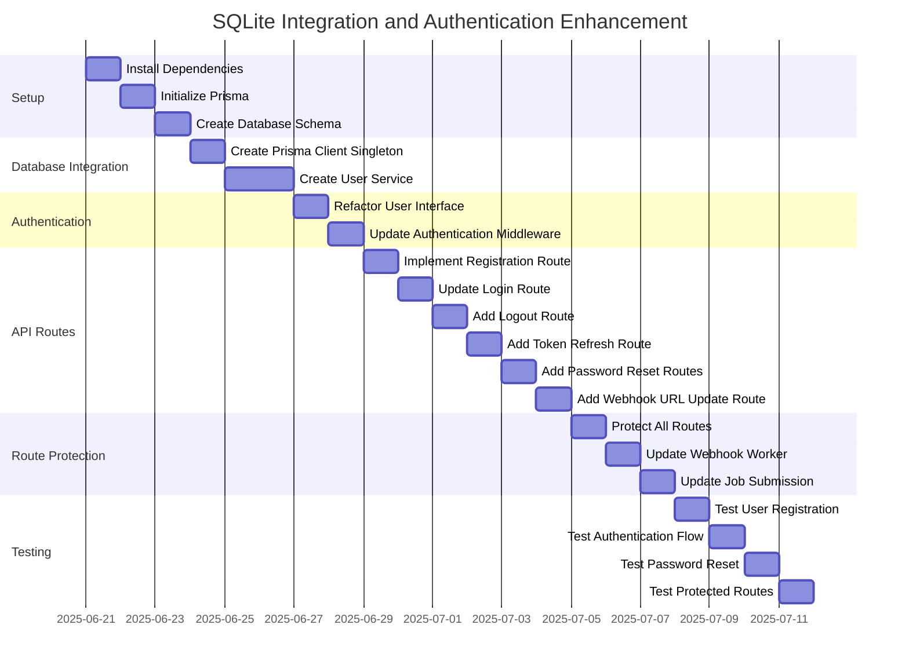

# Enhancement Plan: Adding SQLite Database with Prisma and User Authentication

Based on the analysis of the current codebase and your preferences, I've created a detailed plan to enhance the application with SQLite database integration using Prisma ORM and implement intermediate-level user authentication.

## 1. Project Setup and Dependencies

### 1.1 Add Required Dependencies

```bash
pnpm add @prisma/client bcrypt
pnpm add -D prisma @types/bcrypt
```

- **@prisma/client & prisma**: For SQLite database integration and ORM
- **bcrypt**: For password hashing
- **@types/bcrypt**: TypeScript type definitions for bcrypt

### 1.2 Initialize Prisma

```bash
npx prisma init --datasource-provider sqlite
```

This will create:
- A `prisma` directory
- A `prisma/schema.prisma` file
- A `.env` file with the database connection string

## 2. Database Schema Design

### 2.1 Define Prisma Schema

Create the following schema in `prisma/schema.prisma`:

```prisma
generator client {
  provider = "prisma-client-js"
}

datasource db {
  provider = "sqlite"
  url      = env("DATABASE_URL")
}

model User {
  id                Int       @id @default(autoincrement())
  username          String    @unique
  password          String
  email             String?   @unique
  webhookUrl        String?
  createdAt         DateTime  @default(now())
  updatedAt         DateTime  @updatedAt
  
  // For token refresh
  refreshToken      String?   @unique
  refreshTokenExpiry DateTime?
  
  // For password reset
  resetToken        String?   @unique
  resetTokenExpiry  DateTime?
}
```

### 2.2 Update Environment Variables

Add the following to the `.env` file:

```
DATABASE_URL="file:./dev.db"
TOKEN_SECRET=your_jwt_secret_key
REFRESH_TOKEN_SECRET=your_refresh_token_secret
TOKEN_EXPIRY=1800s
REFRESH_TOKEN_EXPIRY=7d
```

### 2.3 Generate Prisma Client and Create Database

```bash
npx prisma migrate dev --name init
```

## 3. Database Integration

### 3.1 Create Database Client Singleton

Create a new file `src/lib/prisma.ts`:

```typescript
import { PrismaClient } from '@prisma/client';

// Create a singleton instance of PrismaClient
const prisma = new PrismaClient();

export default prisma;
```

### 3.2 Create User Service

Create a new file `src/services/userService.ts` with methods for:
- User registration
- Login with token generation
- Logout and token invalidation
- Token refresh
- Password reset functionality
- User data retrieval and updates

## 4. Authentication Middleware Refactoring

### 4.1 Update User Interface

```typescript
interface User {
  userId: number;
  username: string;
}
```

### 4.2 Refactor Authentication Middleware

Update the existing middleware to verify users against the database.

## 5. API Routes Implementation

### 5.1 New Routes to Add
- User registration (`/register`)
- Logout (`/logout`)
- Token refresh (`/refresh-token`)
- Password reset request (`/request-password-reset`)
- Password reset (`/reset-password`)
- Webhook URL update (`/webhook-url`)

### 5.2 Routes to Update
- Login (`/login`)
- Protected route (`/protected`)
- Submit job (`/submit-job`)

## 6. Route Protection

Ensure all necessary routes are protected:
- Root route (`/`)
- Webhook notification route (`/:id`)
- Bull Board UI (`/admin`)

## 7. Implementation Plan



## 8. Security Considerations

1. **Password Storage**: Passwords are hashed using bcrypt before storage
2. **Token Management**: 
   - Access tokens have a short lifespan (30 minutes by default)
   - Refresh tokens are stored in the database and can be invalidated
   - Password reset tokens expire after 1 hour
3. **Input Validation**: All user inputs are validated before processing
4. **Error Handling**: Error messages don't reveal sensitive information
5. **Route Protection**: All sensitive routes are protected with authentication

## 9. Future Enhancements

1. **Email Integration**: Add actual email sending for password reset
2. **Rate Limiting**: Implement rate limiting for authentication endpoints
3. **Two-Factor Authentication**: Add 2FA for enhanced security
4. **Audit Logging**: Track authentication events for security monitoring
5. **Role-Based Access Control**: Implement user roles and permissions