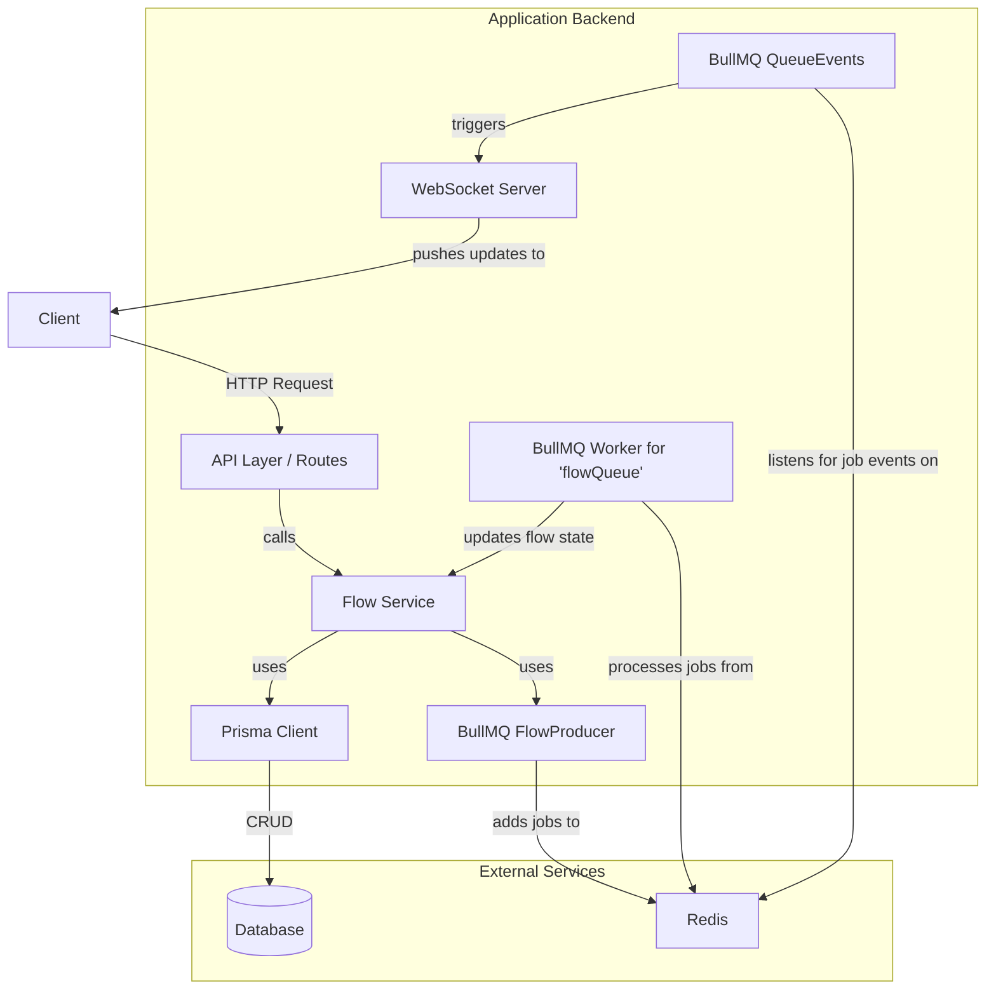
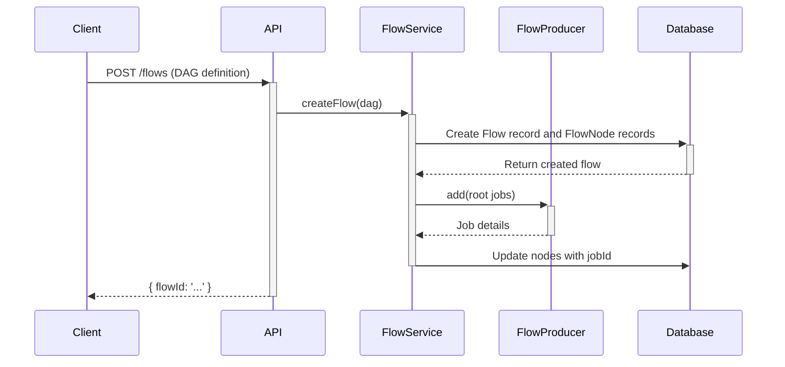

### 1. Introduction

The objective is to implement a robust backend system for creating, managing, and monitoring job workflows using `bullMQ`'s Flow feature. This plan outlines the architecture, data models, and implementation steps required to deliver the requested features, including adding, deleting, and checking the status of flows, with real-time updates via websockets.

A key challenge is that BullMQ flows are designed for children's results to be passed to a parent, while your requirement is the opposite. To address this, I propose a solution where we manage the Directed Acyclic Graph (DAG) logic within our application. A worker will be responsible for starting the next job in the sequence upon the completion of a predecessor, passing the necessary data along.

### 2. Architecture Overview

The proposed architecture consists of several interconnected components:

*   **API Layer**: A set of RESTful endpoints to expose flow management functionalities (create, status, delete).
*   **Service Layer**: Contains the core business logic for handling flows, interacting with the database and `bullMQ`.
*   **Database (Prisma)**: We will introduce new Prisma models to store the definition and state of each flow and its constituent jobs. This is crucial for persistence and for managing operations like deletion and status checks, which are not natively bundled as a single "flow" command in BullMQ.
*   **`bullMQ`**: We'll use `FlowProducer` to add jobs, `Worker` to process jobs, and `QueueEvents` to listen for job status changes.
*   **WebSocket Server**: Integrates with `QueueEvents` to push real-time updates to connected clients.

Here is a component diagram illustrating the architecture:



### 3. Data Model

To effectively manage flows, we need to persist their structure. I'll update the `prisma/schema.prisma` file to include `Flow` and `FlowNode` models.

```prisma
// In prisma/schema.prisma

model Flow {
  id        String     @id @default(cuid())
  name      String
  createdAt DateTime   @default(now())
  updatedAt DateTime   @updatedAt
  nodes     FlowNode[]
  // Status of the entire flow, e.g., 'active', 'completed', 'failed'
  status    String     @default("pending")
}

model FlowNode {
  id        String   @id @default(cuid())
  flowId    String
  flow      Flow     @relation(fields: [flowId], references: [id], onDelete: Cascade)
  jobId     String?  // The BullMQ job ID
  name      String   // Name of the job
  queueName String
  data      Json
  opts      Json?
  children  String[] // Array of child node names
  parents   String[] // Array of parent node names
  status    String   @default("pending") // e.g., 'pending', 'active', 'completed', 'failed'
}
```

### 4. Feature Implementation Details

#### A. Add Flow (DAG)

A new endpoint will accept a DAG of jobs. The service will persist this structure and add the initial jobs (those with no dependencies) to the `flowQueue`.

**Sequence Diagram:**


*   **API Endpoint**: `POST /flows`
*   **Request Body**: A JSON structure representing the DAG.
    ```json
    {
      "name": "My Image Processing Flow",
      "nodes": [
        { "name": "download-image", "data": { "url": "..." }, "children": ["resize-image", "add-watermark"] },
        { "name": "resize-image", "parents": ["download-image"], "children": ["save-to-s3"] },
        { "name": "add-watermark", "parents": ["download-image"], "children": ["save-to-s3"] },
        { "name": "save-to-s3", "parents": ["resize-image", "add-watermark"] }
      ]
    }
    ```
*   **Logic**:
    1.  Parse the incoming DAG structure.
    2.  Create a `Flow` entry in the database.
    3.  Create corresponding `FlowNode` entries for each node in the DAG.
    4.  Identify root nodes (those with no `parents`).
    5.  Use `FlowProducer.add()` to add these root jobs to the `flowQueue`. Each job's data will include the `flowId` and the `nodeName`.
    6.  Update the `FlowNode` records with the returned `jobId` from BullMQ.

#### B. Job Worker Logic

A dedicated worker will process jobs from `flowQueue`. Its main responsibility is to execute its task and then trigger the next jobs in the DAG.

*   **Worker**: A new worker will be created for `flowQueue`.
*   **Logic**:
    1.  The worker receives a job containing `{ flowId, nodeName, ...data }`.
    2.  Execute the job's business logic.
    3.  On successful completion, the worker calls the `FlowService`.
    4.  The `FlowService` marks the current `FlowNode` as `completed` and passes the result to its children.
    5.  It identifies the child nodes from the stored DAG definition.
    6.  For each child node, it checks if all its parent nodes are complete.
    7.  If all parents are complete, it adds the child job to the `flowQueue` using `FlowProducer`, passing along the combined results from all parent jobs.

#### C. Real-time Updates via WebSockets

We will leverage the existing websocket infrastructure to provide real-time updates on flow progress.

*   **Component**: `QueueEvents` for the `flowQueue`.
*   **Logic**:
    1.  Listen to BullMQ events (`active`, `completed`, `failed`, `progress`) using `QueueEvents`.
    2.  When an event is caught, extract the `jobId`.
    3.  Look up the `FlowNode` and `Flow` from the database using the `jobId`.
    4.  Update the status of the `FlowNode` in the database.
    5.  Emit a websocket event (e.g., `flow:updated`) with the `flowId`, `nodeName`, and the new `status`.
    6.  The frontend will listen for this event and update the UI accordingly. I will integrate with the existing `socketEvents.ts`.

#### D. Check Flow Status by ID

An endpoint to retrieve the current status of all jobs within a flow.

*   **API Endpoint**: `GET /flows/:id`
*   **Logic**:
    1.  The `FlowService` retrieves the `Flow` and its associated `FlowNode`s from the database.
    2.  This provides a complete picture of the flow's structure and the last known status of each node.
    3.  For a more real-time status, we could also query BullMQ directly for the state of each job ID, but relying on our database, updated by `QueueEvents`, will be more efficient.
    4. The service will return the entire flow structure with the current status of each node.

#### E. Delete Flow by ID

An endpoint to remove a flow and all its associated jobs.

*   **API Endpoint**: `DELETE /flows/:id`
*   **Logic**:
    1.  The `FlowService` retrieves the `Flow` and all its `FlowNode` records from the database.
    2.  It iterates through each `FlowNode` that has a `jobId`.
    3.  For each job, it creates a `Queue` instance (`new Queue(node.queueName)`) and removes the job using `job.remove()`. BullMQ's `Job` object needs to be retrieved first using `Job.fromId()`.
    4.  Once all jobs are removed from Redis, the `Flow` record (and its cascaded `FlowNode`s) is deleted from the database.

### 5. Project Structure Changes

To implement this, the following files will be created or modified:

*   `src/routes/flow-routes.ts` (new)
*   `src/services/flow-service.ts` (new)
*   `src/workers/flowWorker.ts` (new)
*   `src/types/flow.ts` (new)
*   `prisma/schema.prisma` (modified)
*   `src/config/queues.ts` (modified to add `flowQueue`)
*   `src/index.ts` (modified to register new routes and workers)
*   `src/events/jobEvents.ts` (modified to handle flow queue events)